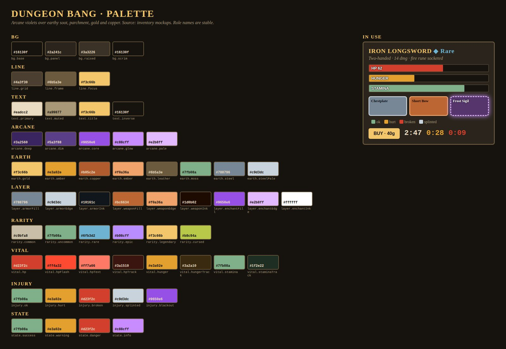
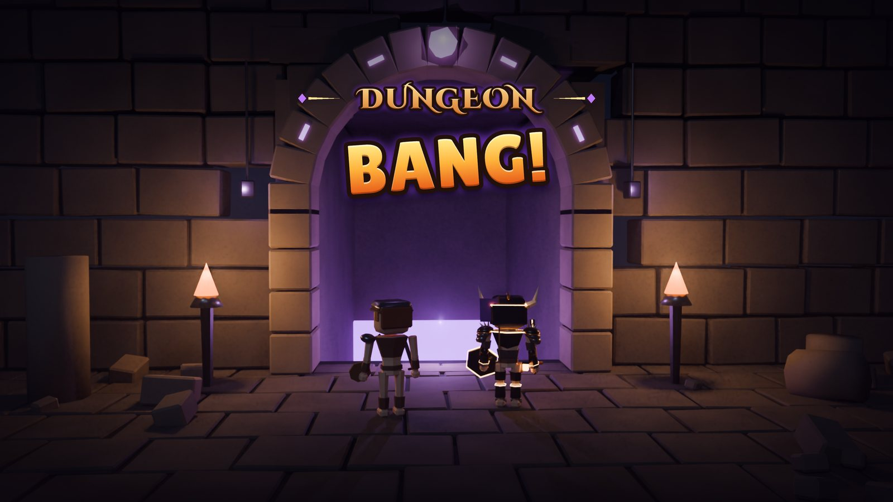
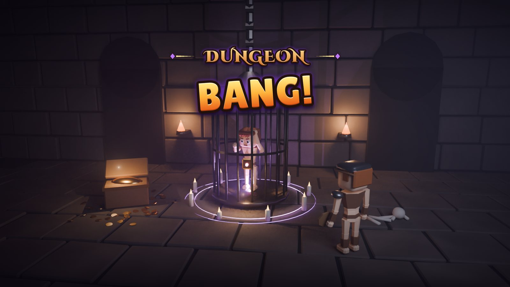
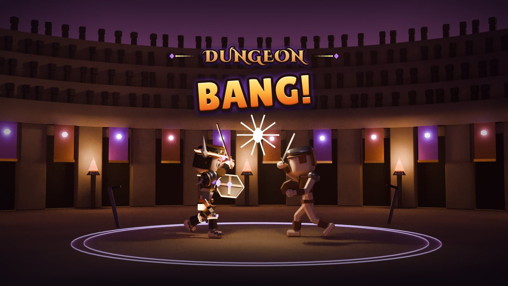
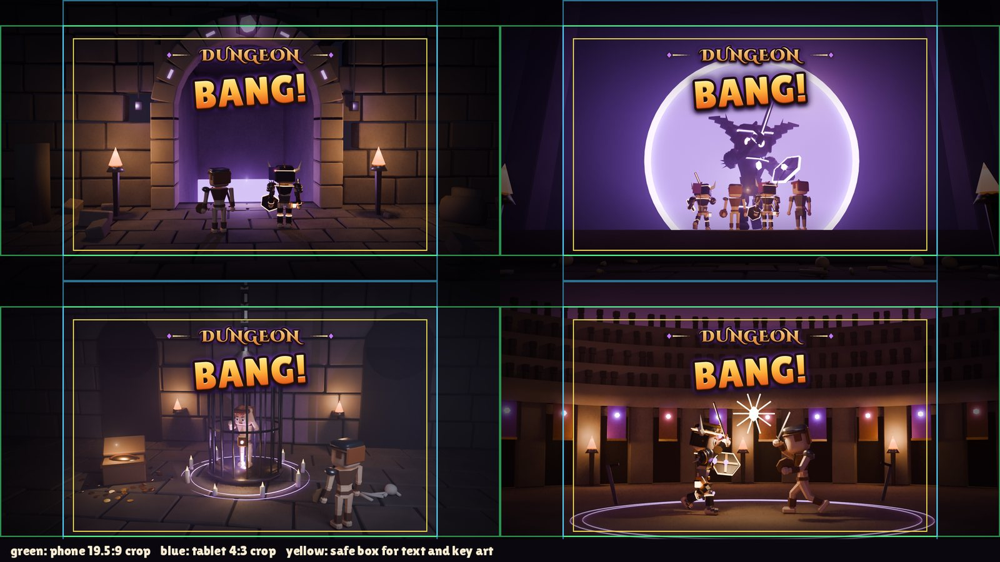

# Art direction and palette

!!! success "Cob's direction (2026-10-01)"
    Arcane colours mixed with earthy tones, from the inventory mockups. **All UI uses the shared palette.** This wiki uses it too.

## Rules Decided

- **Use role names, not hex.** HTML: `var(--db-earth-gold)`. Roblox: `Palette.earth.gold`. Anything else reads `palette.json`.
- **Role names are stable.** Add a role if you need one; never rename or delete one.
- **Earth is the room, arcane is the magic.** Backgrounds, panels, frames and body text are always earthy. Arcane colours mark magic only: enchants, spells, epic loot, events, info hints. Roughly 70% soot and panel, 20% parchment and gold, 10% arcane.
- **Gold is the one highlight.** Titles, selection, the main button. No second highlight colour.
- **Never colour alone.** Injury and rarity always pair colour with an icon or label, for colour-blind players.

### Phone readability

- Health-bar red is a bar colour, not a text colour. Red numbers and damage popups use the lighter `vital.hpText`.
- Muted text only on the base and panel backgrounds at small sizes.
- HUD text over the 3D view gets a dark scrim at 75% opacity.

## Key colours

| Role | Hex | Use |
|-|-|-|
| `bg.base` | `#16130f` | Screen background, dungeon soot |
| `bg.panel` | `#2a241c` | Panels, grid cells, bar tracks |
| `text.primary` | `#eadcc2` | Body text, parchment |
| `earth.gold` | `#f3c66b` | The one highlight: titles, coins, selection |
| `earth.amber` | `#e3a02e` | Hunger, warnings, torchlight |
| `earth.copper` | `#b05c2e` | Weapon fill, forged metal |
| `earth.moss` | `#7fb08a` | Stamina, healthy, success |
| `earth.steel` | `#788796` | Armor fill |
| `arcane.core` | `#9650e6` | Enchant fill, spell icons |
| `arcane.glow` | `#c88cff` | Glows, active enchant halo |
| `vital.hp` | `#d23f2c` | Health bar |

### Rarity

| Rarity | Hex | Colour |
|-|-|-|
| Common | `#c9bfa8` | Bone |
| Uncommon | `#7fb08a` | Moss |
| Rare | `#6fb3d2` | Cold steel-blue, the only blue |
| Epic | `#b98cff` | Arcane |
| Legendary | `#f3c66b` | Gold |
| Cursed | `#b8c94a` | Bile |

The full table of roles (bars, injuries, inventory layers, states) lives with the palette source in the project files.

## Loading cards Decided

Four cards, logo only: no tip line or loading bar on the card itself. In Roblox, build the loading screen from layers (art, logo, a TextLabel for tips, a real progress bar) so tips can rotate.

{ width="49%" }
{ width="49%" }
{ width="49%" }
{ width="49%" }

- **Logo:** "DUNGEON" in Cinzel Decorative Black (gold), "BANG!" in Lilita One (orange-gold), with a violet glow. Both fonts are free (SIL Open Font License).
- **Mobile-safe box:** everything important sits inside x 280 to 1640, y 147 to 963 of the 1920 x 1080 card, so it survives a phone crop and a tablet crop.
- Roblox caps image uploads at 1024 px, so the in-game art is uploaded at 1024 x 576.

