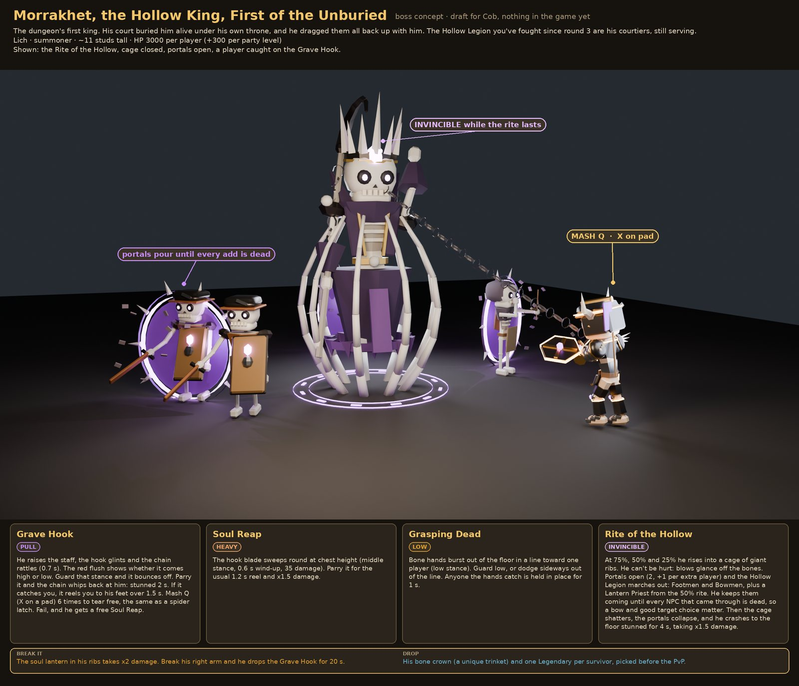

# Boss and finale

!!! success "Decided (Cob, 2026-10-01)"
    The match ends with a boss that scales with **how many players** are in it **and the total dungeon level of the whole party**. Bring friends, and better gear.

## The Hollow King Draft

The prototype's boss is the Hollow King. The [Hollow Legion](enemies.md#hollow-legion-depth-3-to-4) are his dead soldiers, so his add waves reuse their models (Footmen, Bowmen, a Lantern Priest).

### Scaling formula Draft

| Stat | Formula |
|-|-|
| HP | 3,000 x players + 300 x party total level |
| Damage | +10% per 2 players, +1.5% per total level, capped at +75% |
| Adds | One add wave per 2 players; +1 elite add per 10 total levels, max 3 |
| Level cap | Each player's level counts up to 15 |
| Who counts | Players who died before the boss don't count |
| Bonus | Optional: a level-0 survivor in a party with total level 20+ gets a bonus loot roll |

Example: a full party of four with levels 0, 3, 5 and 12 (total 20) faces a boss with 12,000 + 6,000 = 18,000 HP, +50% damage, and 2 elite adds.

Bosses use the same body zones as everyone else, so breaking the boss's legs slows it. See [Combat](combat.md).

## Boss options Draft { #boss-options }

Design only, nothing is in Studio. Cob picks which boss (or bosses) goes in; until then all of this is draft. One boss per match, rolled at the start. The default is that the boss comes after round 6 and before the PvP arena, so it doesn't replace PvP. Same rules as the dungeon: guard the stance a blow comes from, read the red flush, and every boss has a part you can break.

### Morrakhet, the Hollow King { #morrakhet }

**Morrakhet, the Hollow King, First of the Unburied**: the lich Cob asked for, with an ancient name so he doesn't feel generic. The dungeon's first king; his court buried him alive under his throne and he dragged them back up with him. The Hollow Legion are his courtiers.

From Cob:

- He **portals in enemies** and is **invincible until they're all dead**.
- His **chain hook never misses** and **curves around things**. If it catches you, **mash Q** (X on a pad) to tear free, the same as a spider latch.
- His room is **huge**, with room for leaps and **routes across the roof**, and **one entryway** wide enough for 4 players and their companions.

The draft moves:

| Move | What happens |
|-|-|
| **Grave Hook** (pull) | The hook glints and the chain rattles (0.7 s); the red flush shows high or low. Guard that stance and it bounces off; parry it and he's stunned 2 s. Caught, you're reeled to his feet over 1.5 s; fail to break free and he gets a free Soul Reap |
| **Soul Reap** (heavy) | A chest-height sweep (middle, 0.6 s wind-up, 35 damage). Parry it for the usual reel and x1.5 damage |
| **Grasping Dead** (low) | Bone hands burst from the floor in a line toward one player. Guard low or dodge sideways; anyone caught is held for 1 s |
| **Rite of the Hollow** (invincible) | At 75%, 50% and 25% he rises into a cage of giant ribs while portals pour out the Hollow Legion (2 portals, +1 per extra player). When every add is dead, the cage shatters and he's stunned 4 s, taking x1.5 damage |
| **Crawl phase** | After the last rite he climbs a pillar and crawls the vault ribs upside down, dropping on players (a shadow grows for 1 s). Shoot a chandelier as he passes to knock him down for 3 s |

**Weak spots:** the soul lantern in his ribs takes x2 damage; break his right arm and he drops the hook for 20 s. **Drop:** his bone crown (a unique trinket) and one Legendary per survivor.

**The Hall of the Unburied:** 130 by 182 studs, with a bone vault peaking at 72. One 30-stud gate that everyone comes through together, a terrace where his reveal plays safely, a main floor with 8 pillars (the hook bends round them), balconies with four portals, and the throne dais at the north end.

### The other options { #other-bosses }

| Boss | Kind | The fight |
|-|-|-|
| **Gorehorn, the Tusk Chief** | Mounted | The orc war chief on a giant armoured Tusk Hog. First the hog charges in straight lines (dodge; it stuns itself on pillars). Break its front legs or kill it and he's thrown, then fights on foot and blows his Blood Horn for goblin adds |
| **The Silk Mother**, Queen of the Webspinners | Hanging | Hangs above the room on four silk lines, dropping on players and laying egg sacs. Break the four line posts and she falls; on the floor she grabs a player in her pincers (mash Q while teammates hit her face) |
| **Greedmaw, the Hoard Mimic** | Ambusher | Sits in a hoard of coin. Its tongue swallows the silverlings you carry (you get them back doubled when it dies). Below 50% it burrows and pops up under players, and some chests in the vault are little mimics |

## Open

??? question "Does the PvP finale still happen?"
    The original pitch ends with players fighting each other using the gear they gathered. The prototype assumes the boss replaces PvP. Cob hasn't said which, or whether both happen.

??? question "Do companions fight in the finale?"
    Open in the companion draft, along with whether a human companion could betray you or be bribed.
