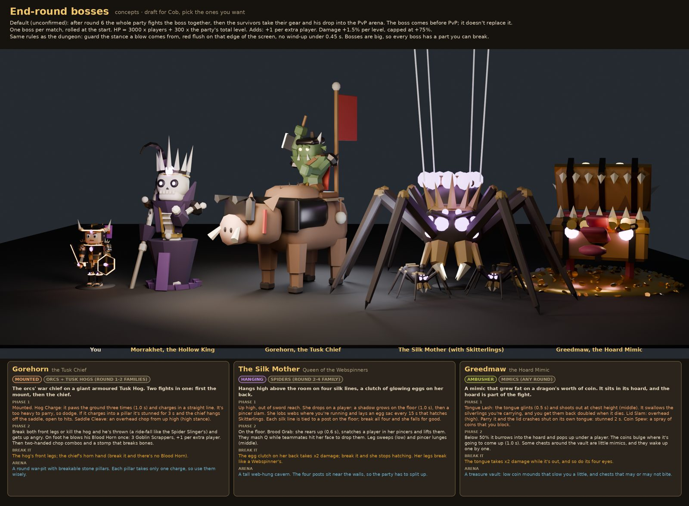

# Boss and finale

!!! success "Decided (Cob, 2026-10-01)"
    The match ends with a boss that scales with **how many players** are in it **and the total dungeon level of the whole party**. Bring friends, and better gear.

## Moment of respite Decided

!!! success "Decided (Cob, 2026-10-02)"
    After round 6 the boss chamber seals and the party gets **30 seconds** to rearrange gear before the boss. Everyone sees **every inventory**, and every change shows up live.

- **The clock** reads `30s`, `29s`… inside a ring of beads that empties as time runs out, and turns red at 10 s.
- **One seat per player**: their portrait (a live head shot of their character) sits above their class map, with their name, class, level and a pill showing Sorting, Moving, Ready or Fallen.
- **Your gear only.** Drag to move it, R or right-click while dragging to rotate, double-tap to rotate in place. The usual [inventory](inventory.md) rules apply: an item stays inside one island of its own layer.
- **Teammates' moves glide in live** with their name tag, and each one lands in a Party moves feed ("Wren moved Frost Sigil onto Leather Vest").
- **Enchants glow** on whatever they cover, and each map lists the links ("Fire Rune on Iron Chestplate"), so you can watch a teammate's combo land.
- **Layer chips** (All, Armour & food, Weapons, Enchants) fade the other layers so stacked items are easy to grab.
- **You can't walk** while the screen is open.
- **Ready** ends it early once every *living* player has pressed it.
- **Fallen teammates keep their seat**: grey portrait with a skull badge, name struck through, a red Fallen tag and an empty map ("Hard death in round 5. All gear lost."). They watch but can't act, and don't hold up Ready.
- **A player who quits** mid-respite shows as **Left** and stops counting for Ready.
- When it ends, a card says "The respite ends" (or "Everyone is ready") and the boss fight starts.

Draft Teammates' maps are read-only, and there's no trading between players yet.

## Where the boss sits Draft

After round 6 and the moment of respite, the whole party fights the boss together. The survivors then take their gear and his drop into the PvP arena, so the boss comes **before** PvP rather than replacing it. There's one boss per match, rolled at the start. Cob hasn't confirmed this order yet.

## Morrakhet, the Hollow King Draft

**Morrakhet, the Hollow King, First of the Unburied.** He is the lich Cob asked for, and the dungeon's first king. His court buried him alive under his own throne, and he dragged them all back up with him. The [Hollow Legion](enemies.md#hollow-legion-depth-3-to-4) you fight from round 3 are his courtiers, so his adds reuse their models. He stands about 11 studs tall.

| Move | Stance | What happens |
|-|-|-|
| **Grave Hook** | High or low | Chain rattle and glint (0.7 s); the red flush shows which stance. Guard that stance and it bounces off. Parry and the chain whips back: he's stunned 2 s. Caught, you're reeled to his feet over 1.5 s; **mash Q** (X on a pad) 6 times to tear free, or he gets a free Soul Reap. The hook **never misses**: it bends around pillars and players, so guarding saves you and hiding doesn't. |
| **Soul Reap** | Middle | Chest-height sweep with the hook blade, 0.6 s wind-up, 35 damage. Parry for the usual reel and x1.5 damage. |
| **Grasping Dead** | Low | Bone hands burst up in a line toward one player. Guard low or dodge out of the line; a catch holds you for 1 s. |
| **Rite of the Hollow** | At 75%, 50%, 25% | He rises into a cage of giant ribs and **can't be hurt**. Portals (2, +1 per extra player) pour out Footmen and Bowmen, plus a Lantern Priest from the 50% rite. He keeps them coming **until every add is dead**, then the cage shatters and he's stunned 4 s, taking x1.5 damage. |
| **Crawl** | Under 25% | He throws off his robe, climbs a pillar and crawls the vault ribs upside down, dropping on players (shadow on the floor for 1.0 s, then a low shockwave). Rib Crawler skeletons drop as adds. Shoot a chandelier as he passes to knock him down for 3 s. |

**Weak points:** the soul lantern in his ribs takes x2 damage. Breaking his right arm means no Grave Hook for 20 s.
**Drop:** his bone crown (a unique trinket) and one Legendary per survivor, picked before PvP.

### The Hall of the Unburied Draft

His room is huge (Cob asked for room to leap and crawl on the roof): 130 studs wide, 182 long, walls 42 high and a bone vault peaking at 72.

- **One shared entryway:** a 30-stud gate, wide enough for 4 players and their companions side by side. A bone portcullis drops behind the last of you and lifts when he dies.
- **The Terrace:** a raised landing inside the gate, safe while his reveal plays. He wakes when someone steps off it, or after 10 s.
- **The Court:** the main floor. Cracked grave slabs show where Grasping Dead come up.
- **8 pillars** in two rows: cover from Bowmen, and what he climbs in the crawl phase.
- **Galleries:** balconies on both sides with four portals in their walls, so adds step out up high and bows get a head start.
- **Dais and Bone Throne** at the north end, where he starts, with two more floor portals.
- **The Vault:** 11 bone ribs (his crawl rails) and three hanging chandeliers.

### Scaling formula Draft

| Stat | Formula |
|-|-|
| HP | 3,000 x players + 300 x party total level |
| Damage | +10% per 2 players, +1.5% per total level, capped at +75% |
| Adds | One add wave per 2 players; +1 elite add per 10 total levels, max 3 |
| Level cap | Each player's level counts up to 15 |
| Who counts | Players who died before the boss don't count |
| Bonus | Optional: a level-0 survivor in a party with total level 20+ gets a bonus loot roll |

Example: a full party of four with levels 0, 3, 5 and 12 (total 20) faces a boss with 12,000 + 6,000 = 18,000 HP, +50% damage, and 2 elite adds.

Bosses use the same body zones as everyone else, so breaking the boss's legs slows it. See [Combat](combat.md).

## Other boss options Draft

Three more concepts sit beside Morrakhet. Cob hasn't picked any of them yet.

- **Gorehorn, the Tusk Chief** (mounted). The orc war chief on a giant armoured Tusk Hog, two fights in one. The hog's Hog Charge can't be parried, so dodge it; charging into a pillar stuns it, and each pillar breaks after one charge. Break both front legs or kill the hog and he's thrown, then fights on foot with a Blood Horn that calls Goblin Scrappers.
- **The Silk Mother, Queen of the Webspinners** (hanging). She hangs high on four silk lines tied to floor posts near the walls, dropping on players, lobbing webs and laying egg sacs. Break all four posts and she falls for good, then grabs players in her pincers (mash Q). Her egg clutch takes x2 damage.
- **Greedmaw, the Hoard Mimic** (ambusher). A coin-fat mimic in a treasure vault. Its Tongue Lash swallows your carried silverlings, which come back doubled when it dies. Parrying its Lid Slam stuns it 2 s. Below 50% it burrows and pops up under players, and the chests around the vault wake up as little mimics.

## Open

??? question "Which boss, or a pool?"
    Morrakhet is the lead concept. Gorehorn, the Silk Mother and Greedmaw are options. Cob hasn't picked which go in.

??? question "Can teammates trade gear during the respite?"
    Not in the first build. Each player can only move their own gear.

??? question "Does the PvP finale still happen?"
    The original pitch ends with players fighting each other using the gear they gathered. The current draft has the boss **before** PvP, with survivors carrying his drop into the arena. Cob hasn't confirmed it.

??? question "Do companions fight in the finale?"
    Open in the companion draft, along with whether a human companion could betray you or be bribed.
