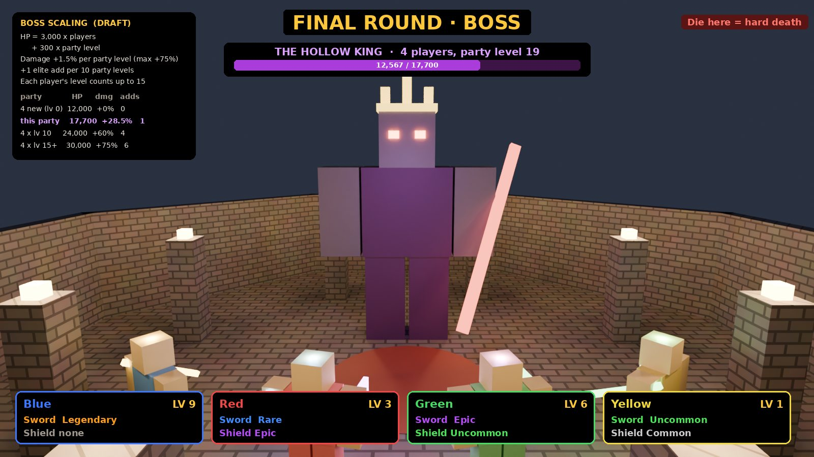
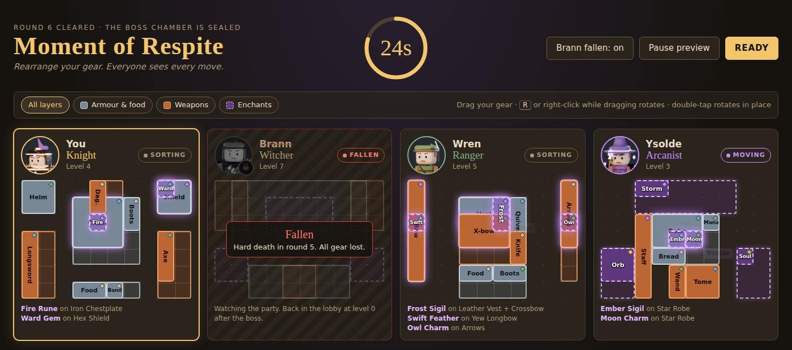
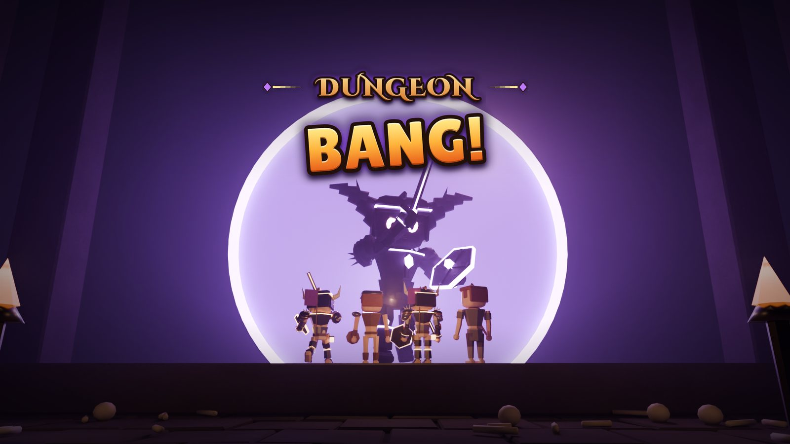

# Boss and finale

!!! success "Decided (Cob, 2026-10-01)"
    The match ends with a boss that scales with **how many players** are in it **and the total dungeon level of the whole party**. Bring friends, and better gear.

## Moment of respite Decided

!!! success "Decided (Cob, 2026-10-02)"
    After round 6 the boss chamber seals and the party gets **30 seconds** to rearrange gear before the boss. Everyone sees **every inventory**, and every change shows up live.

- **The clock** reads `30s`, `29s`… inside a ring of beads that empties as time runs out, and turns red at 10 s.
- **One seat per player**: their portrait (a live head shot of their character) sits above their class map, with their name, class, level and a pill showing Sorting, Moving, Ready or Fallen.
- **Your gear only.** Drag to move it, R or right-click while dragging to rotate, double-tap to rotate in place. The usual [inventory](inventory.md) rules apply: an item stays inside one island of its own layer.
- **Teammates' moves glide in live** with their name tag, and each one lands in a Party moves feed ("Wren moved Frost Sigil onto Leather Vest").
- **Enchants glow** on whatever they cover, and each map lists the links ("Fire Rune on Iron Chestplate"), so you can watch a teammate's combo land.
- **Layer chips** (All, Armour & food, Weapons, Enchants) fade the other layers so stacked items are easy to grab.
- **You can't walk** while the screen is open.
- **Ready** ends it early once every *living* player has pressed it.
- **Fallen teammates keep their seat**: grey portrait with a skull badge, name struck through, a red Fallen tag and an empty map ("Hard death in round 5. All gear lost."). They watch but can't act, and don't hold up Ready.
- **A player who quits** mid-respite shows as **Left** and stops counting for Ready.
- When it ends, a card says "The respite ends" (or "Everyone is ready") and the boss fight starts.

Draft Teammates' maps are read-only, and there's no trading between players yet.

## The Hollow King Draft

The prototype's boss is the Hollow King. The [Hollow Legion](enemies.md#hollow-legion-depth-3-to-4) are his dead soldiers, so his add waves reuse their models (Footmen, Bowmen, a Lantern Priest).

### Scaling formula Draft

| Stat | Formula |
|-|-|
| HP | 3,000 x players + 300 x party total level |
| Damage | +10% per 2 players, +1.5% per total level, capped at +75% |
| Adds | One add wave per 2 players; +1 elite add per 10 total levels, max 3 |
| Level cap | Each player's level counts up to 15 |
| Who counts | Players who died before the boss don't count |
| Bonus | Optional: a level-0 survivor in a party with total level 20+ gets a bonus loot roll |

Example: a full party of four with levels 0, 3, 5 and 12 (total 20) faces a boss with 12,000 + 6,000 = 18,000 HP, +50% damage, and 2 elite adds.

Bosses use the same body zones as everyone else, so breaking the boss's legs slows it. See [Combat](combat.md).

## Open

??? question "Can teammates trade gear during the respite?"
    Not in the first build. Each player can only move their own gear.

??? question "Does the PvP finale still happen?"
    The original pitch ends with players fighting each other using the gear they gathered. The prototype assumes the boss replaces PvP. Cob hasn't said which, or whether both happen.

??? question "Do companions fight in the finale?"
    Open in the companion draft, along with whether a human companion could betray you or be bribed.
