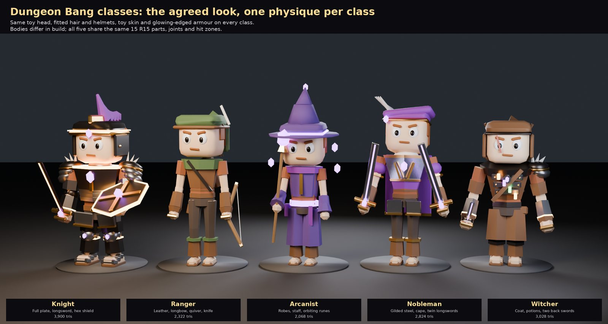
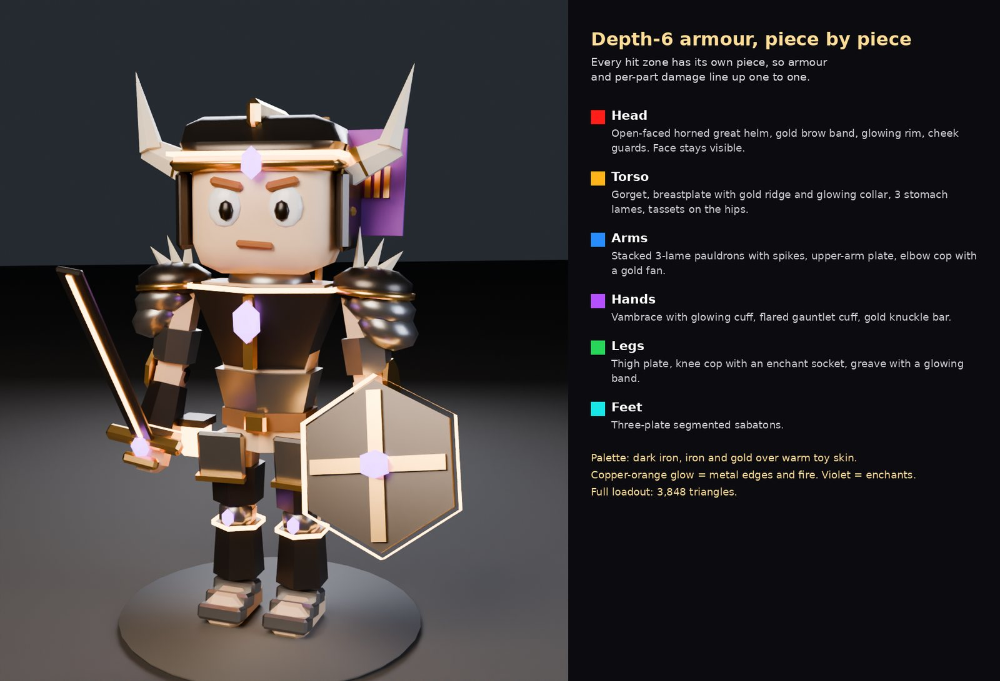
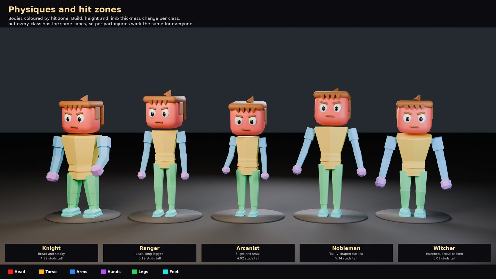
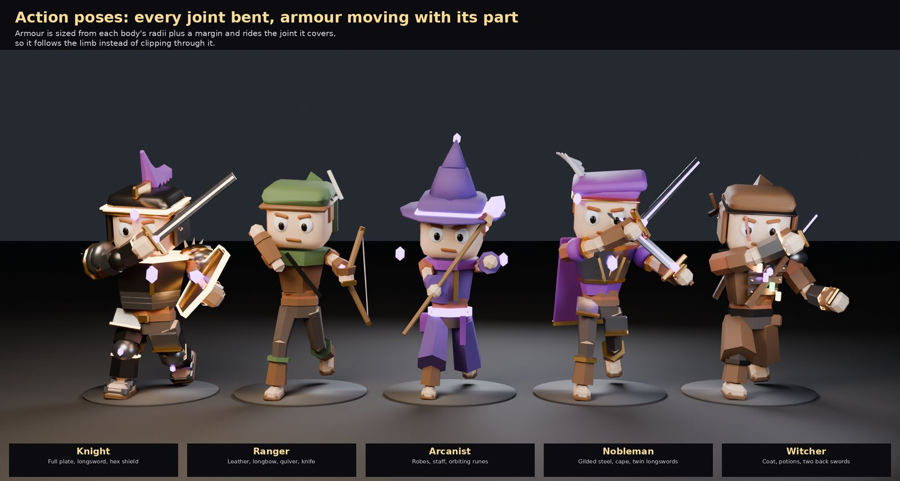
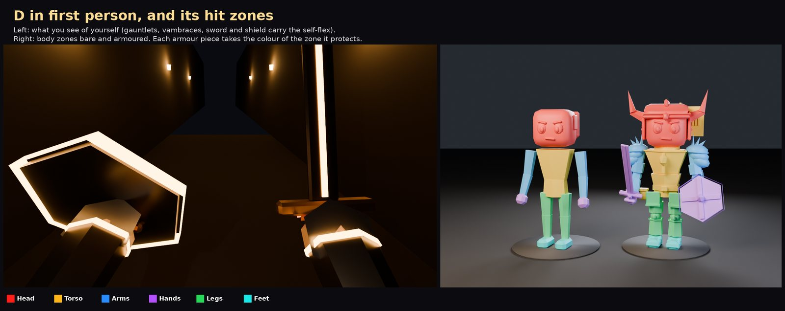
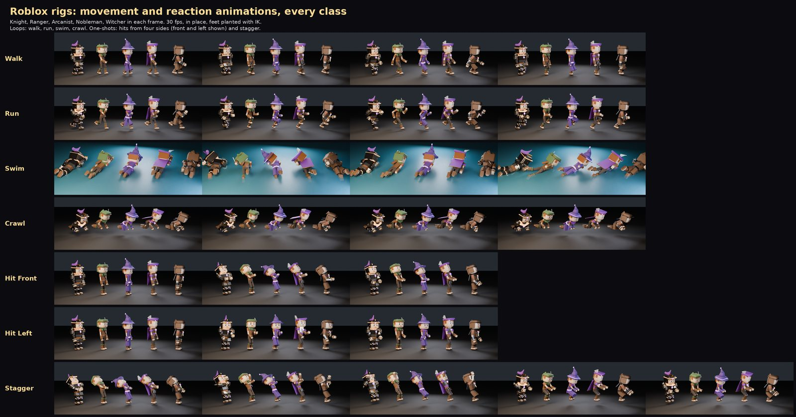

# Classes and characters

## Look Decided

- Mobile-first but fun on desktop.
- Detailed heads and adornments on simpler bodies. Flexible joints. Per-body-part damage.
- Style **"D", the Glowing Brute**: chunky toy build, big block head at its original size, toy skin, fitted hair, helmets shaped to hug the head, and armor that grows in visible tiers.
- Each class has its own physique.
- Everyone wears a plain **tunic and trousers** under their kit, so no build reads as naked.

Armor grows in three visible tiers: starter, depth 3 leather and cap, depth 6 full plate. Every hit zone gets its own armor piece.

## The five classes

| Class | Physique | Height (studs) | Kit | Inventory shape |
|-|-|-|-|-|
| Knight | Broad, stocky, short thick legs | 4.99 | Full plate, longsword, hex shield | Heavy armor, small enchant zone |
| Ranger | Lean, long-legged | 5.19 | Leather, longbow, quiver, knife | Wide weapon rack, light armor |
| Arcanist | Slight and small | 4.92 | Robes, staff, orbiting runes | Cloth armor, huge enchant layer |
| Nobleman | Tall, V-shaped duellist | 5.34 | Gilded steel, cape, twin longswords | Two longsword strips, larger armor, smaller third layer |
| Witcher | Hunched, broad-backed, long arms | 5.03 | Coat, potion bandolier, two back swords | Large armor, separated weapon slots, decent third layer |

All classes share the same 15 R15 parts, joints and hit zones; only proportions and gear change. See [Inventory](inventory.md#class-layouts) for each class's grid.

## Hit zones

Each R15 part is its own Roblox part, so a hit already knows what it struck. Layer-1 armor protects only the zone it's mounted on. Damage rules are on [Combat](combat.md#health-model).

## Animations

| Animation | Frames (30 fps) | Loops | Notes |
|-|-|-|-|
| Walk | 0 to 32 | yes | Feet planted with IK; per-class gait |
| Run | 0 to 20 | yes | Lean, pumping arms, flight phase |
| Swim | 0 to 40 | yes | Front crawl with a breath each cycle |
| Crawl | 0 to 36 | yes | Hands and knees; tunnels or dragging yourself while downed |
| Hit Front / Back / Left / Right | 0 to 18 | no | Flinch away from the side of the hit |
| Stagger | 0 to 56 | no | Being reworked: fall back and catch yourself, impact, recovery, feet planted |

No attack animations: each weapon brings its own.
