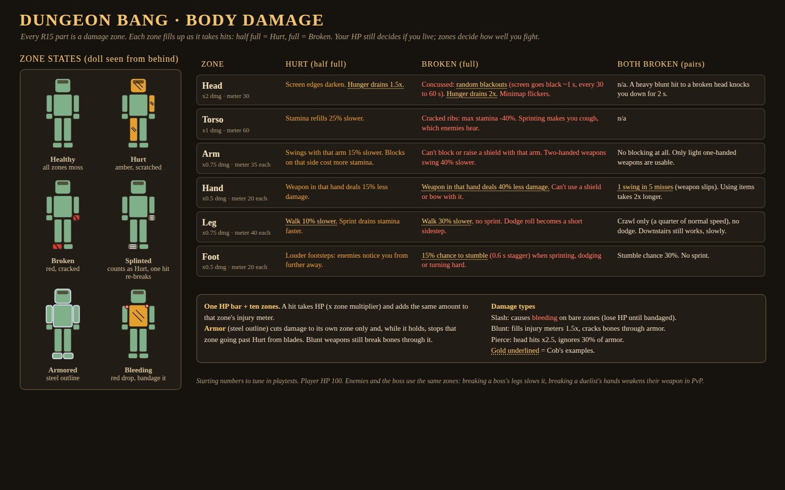
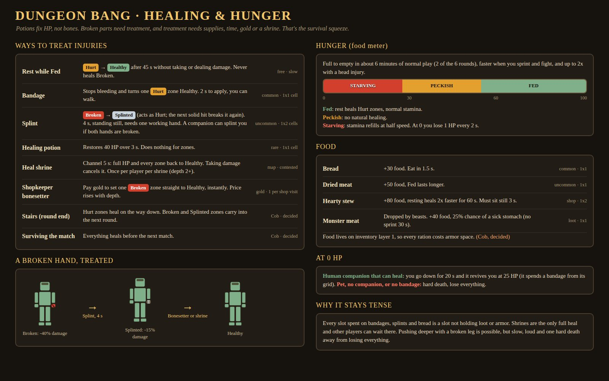
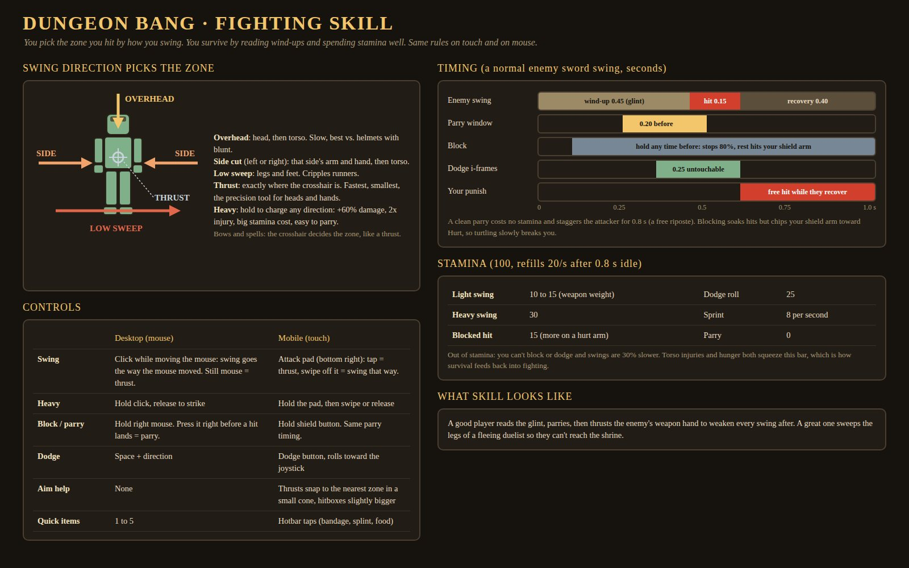

# Combat and injuries

!!! success "Brief"
    Very skill based and survival strained. Per-body-part damage is part of it: a broken hand means a weaker weapon, both hands broken means occasional missed swings, legs make you slower, feet make you stumble, and a head injury causes random blackouts or needing more food.

**Decided:**

1. Hunger is a draining meter: you need food. Food lives on inventory layer 1.
2. Broken bones carry into the next round, not into the next match.
3. At 0 HP you get revived only if you have a human companion that can heal.
4. Swings are directional.
5. The penalties are harsh enough for now.

Everything else on this page is Draft: numbers are starting points for playtests.

## Health model

- One HP bar (100) decides life and death. Ten zones: head, torso, 2 arms, 2 hands, 2 legs, 2 feet (the R15 parts, grouped).
- A hit takes HP times the zone multiplier and adds the same amount to that zone's injury meter.
- A meter half full is **Hurt**, full is **Broken**.
- Armor protects only its own zone, cuts damage there, and stops blades from breaking that zone while it holds.

| Zone | HP multiplier | Injury meter |
|-|-|-|
| Head | x2 | 30 |
| Torso | x1 | 60 |
| Arm | x0.75 | 35 |
| Hand | x0.5 | 20 |
| Leg | x0.75 | 40 |
| Foot | x0.5 | 20 |

**Damage types:** slash causes bleeding on bare zones; blunt does 1.5x injury and breaks through armor; pierce does x2.5 to the head and ignores 30% of armor.

## Injury effects

| Zone | Hurt | Broken | Both broken |
|-|-|-|-|
| Head | Edges darken, hunger 1.5x | Blackouts of ~1 s every 30 to 60 s, hunger 2x, minimap flickers | n/a; a heavy blunt hit = 2 s knockdown |
| Torso | Stamina regen -25% | Max stamina -40%, sprint cough you can hear | n/a |
| Arm | That arm 15% slower, blocks cost more | Can't block with it, two-handers 40% slower | No blocking, light one-handers only |
| Hand | Weapon -15% damage | Weapon -40% damage, no shield or bow in it | 1 in 5 swings miss, items 2x slower |
| Leg | Walk -10% | Walk -30%, no sprint, dodge becomes a sidestep | Crawl at 25% speed, no dodge |
| Foot | Loud footsteps | 15% stumble (0.6 s) on sprint, dodge or hard turn | 30% stumble, no sprint |

Loud footsteps also widen how far enemies hear you.

## Treatment and hunger

| Treatment | Effect |
|-|-|
| Rest while Fed | A Hurt zone heals after 45 s out of combat |
| Bandage | Stops bleeding and heals one Hurt zone (2 s) |
| Splint | Broken becomes Splinted (4 s, standing; a companion can apply it) |
| Potion | HP only |
| Heal shrine | 5 s channel, full heal, once per player per shrine |
| Shop bonesetter | Silverlings and goldlings, fixes one Broken zone |
| Stairs | Heal Hurt zones; Broken and Splinted zones carry into the next round |
| Surviving the match | Heals everything Decided |

**Hunger** runs 0 to 100, full to empty in about 6 minutes of normal play, faster when sprinting, fighting or head-injured.

| State | Food | Effect |
|-|-|-|
| Fed | over 60 | Natural healing works |
| Peckish | 30 to 60 | No natural healing |
| Starving | under 30 | Half stamina regen |
| Empty | 0 | -1 HP every 2 s |

Food: bread +30, dried meat +50, hearty stew +80 with 2x healing (shop), monster meat +40 with a 25% chance of getting sick. Food takes space on [inventory](inventory.md) layer 1, so every ration competes with armor.

## Downed at 0 HP

- **With a human companion that can heal:** you go down for 20 s (crawl only, can't fight). The companion runs to you and revives you at 25 HP with your zones unchanged. If it is downed or dead first, or 20 s pass, it's a hard death.
- **With a pet or no companion:** instant hard death.
- Assumed every human companion can heal (Porter and Squire), using a bandage from its own grid; without one it can't revive.

## Fighting skill

- **Stances**: you fight from a **high**, **middle** or **low** stance and attack and guard from it. A guard only blocks a blow from the **same** stance, and a red flush on the screen edge shows where an enemy attack comes from (top high, bottom low, left or right for side swings), brightening in the parry window. Fliers and spiders have no stance, so any guard works on them. Click for a light attack or hold for a heavy: +60% damage, 2x injury, but parryable. This replaces the attack hub. See [Controls](controls.md#stances).
- **Which cut each stance throws** Draft: high is the overhead (head or chest), middle alternates left and right slashes (that side's arm, hand or torso), low is the low sweep (legs and feet). No thrust for now.
- **Desktop:** scroll up, middle click and scroll down pick the stance; left click attacks; hold right mouse to guard; Space plus a direction to dodge; F to focus.
- **Mobile:** three stance buttons on the right edge In prototype; attack, guard and dodge buttons are still planned.
- **Combat tuning**: harder to evade, enemies swing longer and hit harder, parries are easier to read, and the red flush is bolder. Draft numbers: enemy wind-ups x1.5, enemies stop tracking you 0.25 s before the hit, parry window 0.2 s, enemy damage x1.5, chase speed x1.2, dodge cooldown 0.8 s, dodge invincibility 0.15 s.
- **Enemy swing timing** (before the tuning above): 0.45 s wind-up with a glint, 0.15 s hit, 0.40 s recovery. A **parry** is guard pressed in the 0.2 s before impact: no damage, no stamina, and the attacker is staggered for 0.8 s.
- Block stops 80% from the front; the rest chips the shield arm.
- **Stamina** 100, refills 20/s after 0.8 s idle. Light swing 10 to 15, heavy 30, blocked hit 15, dodge 25, sprint 8/s, parry free. Empty stamina means no block or dodge and swings 30% slower.
- Enemies and the boss use the same zones.

### Special abilities In prototype { #abilities }

Each class has **one powerful ability**, charged by **parrying**, to reward good guarding. It has a cinematic look: an impact frame and a short hitstop when it lands; the camera never moves. Press **X** (Y on a gamepad) when the **Resolve** bar in the HUD is full.

| Class | Ability | What it does Draft numbers |
|-|-|-|
| Knight | **Bastion** | Slams the shield: a shockwave and a dome over nearby allies (12 studs, 30% less damage). For 8 s your guard covers all three stances and every blow on it counts as a timed parry. You move at 85% |
| Nobleman | **Gilded Reprisal** | Both blades flare gold and he dashes 14 studs through the line, untouchable for 0.45 s. A beat after he lands, every cut opens: 2.5x your heavy on each enemy, and they reel 1.2 s |
| Ranger | **Pinning Shot** | A beam charges on the bow for 0.8 s (aim follows you), then tears down the line: 80 studs long, 4 wide, 3x a heavy shot on each enemy. Each one is pinned for 3 s; fliers are knocked down |
| Arcanist | **Rune Nova** | The runes spin up over a floor glyph, then a 14-stud dome of force blasts out: 2x your heavy, 10 studs of knockback and a 1.5 s stagger. The runes then orbit as a ward that soaks the next 3 hits (8 s) |
| Witcher | **Grim Tonic** | Knocks back a tonic (0.7 s), then burns with an ember outline for 10 s: +40% damage, heals 30% of damage dealt, and injuries cause no slowdown or weak swings |

**Resolve** Draft: a timed parry gives +25, parrying a heavy +35, deflecting a projectile +25, a plain block +8. Each parry within 4 s of the last adds +5 more. Attacking gives nothing. About four parries fill it.

### Enemy injuries Decided { #enemy-injuries }

!!! success "Decided"
    Humanoid enemies take body-part damage like players, and hitting the same limb again (for example the right arm) hurts them more each time, just like it does for players.

In the Studio prototype In prototype:

- **Goblins, orcs (elites included) and skeletons** use the player injury steps: hurt, then broken, scaled to their health.
- **Legs** slow them, a **broken foot** makes them stumble, **arm** injuries weaken their hits, **two broken arms** make some swings miss, and **head** hits daze them.
- **Fliers** take no limb injuries.

**Hurt parts flash red** Decided, so you can see where an enemy is hurt:

- A **Hurt** limb pulses red, on that part only.
- A **Broken** limb pulses a deeper red.
- A hit that newly hurts a part gives one quick, bright flash.
- Fliers take no limb injuries, so they never flash.

The exact look is being built in Studio and isn't tested yet.

### Enemy guard In prototype { #enemy-guard }

Enemies can raise a guard. The tell is obvious: the weapon comes up across the body, a steel-white outline appears and a soft clink plays. The guard lasts about 0.7 to 0.9 s.

| You hit the guard with | What happens |
|-|-|
| A light swing | You get parried: pushed back, no swings for 0.8 s, and the enemy gets a free counter |
| A heavy (hold left click, then release) | The guard breaks: the enemy reels and takes 1.5x damage for a moment |

The timings and multiplier are prototype values from the Studio build and may change.

### Parries and disarms In prototype { #disarms }

!!! success "Decided"
    Parried enemies reel, and a parry can randomly knock the weapon out of their hands. It works both ways. A dropped weapon goes back into the same inventory slot when picked up, or the player is told they don't have room.

| You parry | The enemy | Disarm chance |
|-|-|-|
| A light attack | Reels for 0.8 s | 10% |
| A heavy attack | Reels for 1.2 s and takes 1.5x damage while reeling | 35% |

- **It works both ways:** if an enemy's guard parries your light swing, there's a 10% chance you lose your sword.
- A disarmed weapon flies **4 to 6 studs**. Until you pick it up you can only dodge.
- **Walk over the weapon** to pick it up. It goes back into its **active weapon slot** (see [Inventory](inventory.md#active-weapon)).
- Pickup animations are wanted Planned.

All numbers are prototype values.

### Enemy tells and behaviour In prototype

| Tell | What it means |
|-|-|
| Ember glow and a soft growl, about 0.8 s wind-up | **Heavy.** It smashes through a plain block, so parry or dodge it |
| The glint holds longer than usual | **Delayed swing.** Wait for it before you parry |
| A quick glint with no gold parry ring | **Feint.** Don't commit your parry |

- Enemies run a small **learning brain** that adapts to each player's habits during a match.
- Enemies **aim at your broken limbs**: +25% damage on an already-broken limb.
- Goblins only rarely go for a heavy head swing (8 s heavy cooldown).
- **Weaker enemies back off when hurt.**
- **No stacking**: once in fighting range, an enemy blocked by another one strafes around it instead of waiting behind it.
- **Every enemy has a health bar** and flashes red when hit.
- **Brain v5** Draft, untested in play: enemies attack the stance you **aren't** guarding, and their own guard covers the stance you're in. They pull hard toward a healer who is reviving someone. Spiders: see [Enemies](enemies.md#spiders).

Timings are prototype values.

## Open

??? question "Which human companions can heal?"
    The draft says all of them, using a bandage from their grid. A dedicated Medic class is the alternative.
