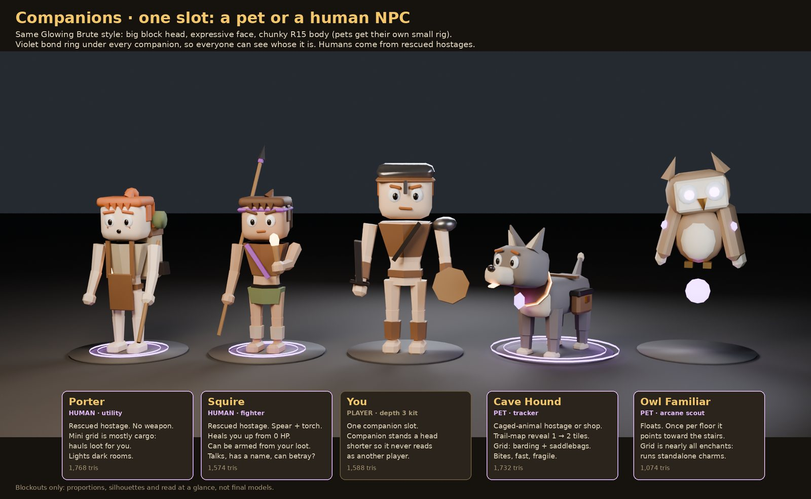
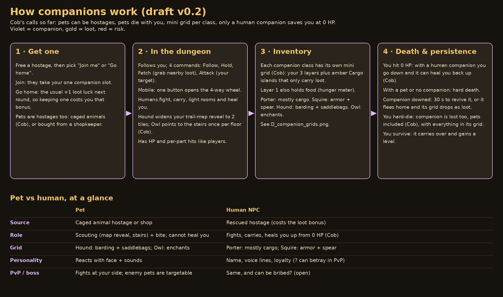
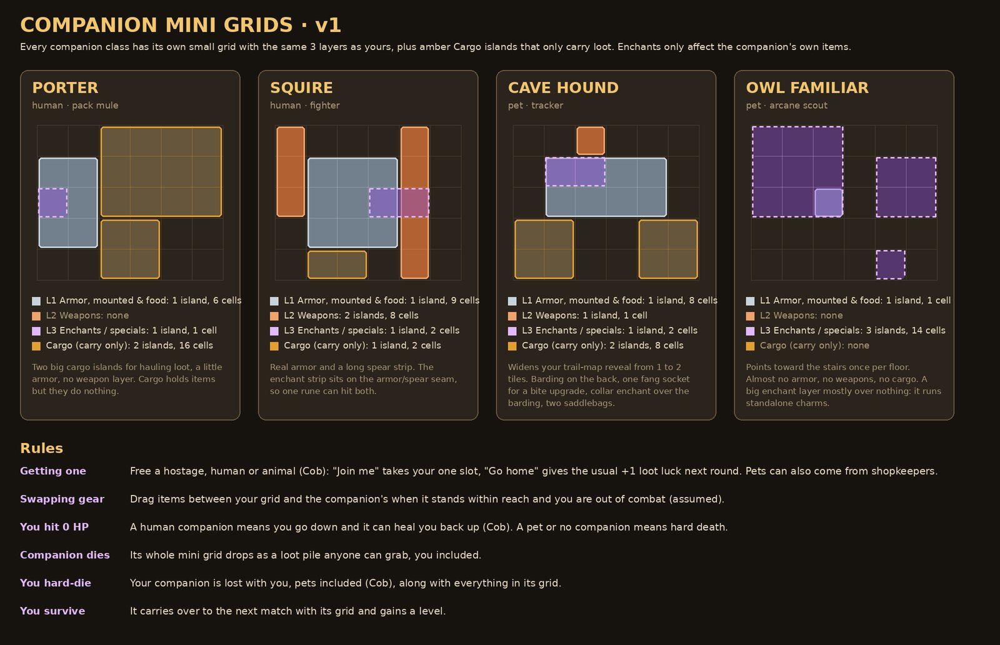
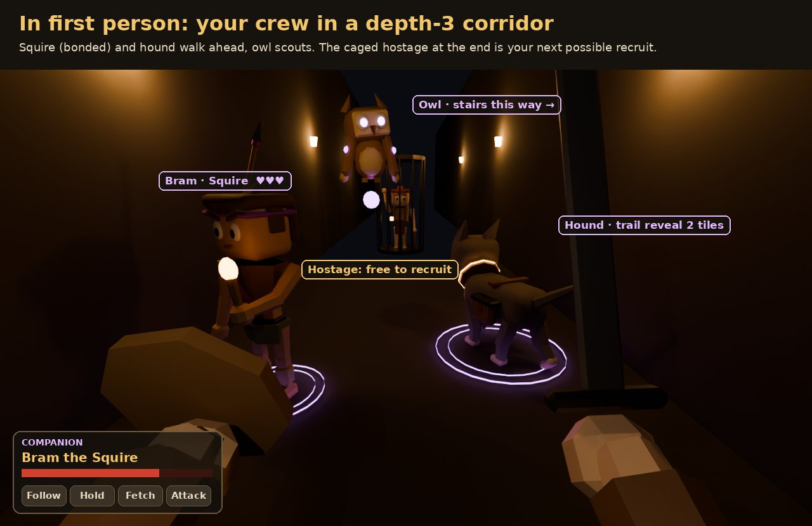

# Companions

## Decided Decided

From Cob, 2026-10-01:

- You can keep **either a pet or a human NPC** tagging along.
- **Pets can be hostages too**, just like people.
- Companions **die with you** on a hard death, pets included.
- Each companion class has its own **mini grid**.
- At 0 HP, a **human** companion that can heal lets you be revived from a downed state. With a pet or no companion, 0 HP is a hard death.
- **Cave Hound:** widens your trail-map reveal from 1 tile to 2 tiles.
- **Owl Familiar:** points toward the stairs once per floor.

## How it works Draft

- **One companion slot.** A full slot means dismissing the current companion to take a new one.
- Drawn in the player style. Humans are 84% of player height so they never read as another player. A violet bond ring under each companion shows whose it is, to enemies in PvP too.
- **Getting one:** free a caged hostage, then pick "Join me" (takes the slot) or "Go home" (the usual +1 loot luck next round). Keeping one costs you that bonus. Pets can also be bought from shopkeepers Assumed.
- **Commands:** Follow, Hold, Fetch (grab nearby loot), Attack (your target). On mobile one button opens a 4-way wheel.
- Companions have HP and body-zone hits like players. A downed companion gives you 30 s to revive it, else it flees home and is lost.
- **Companion dies:** its whole mini grid drops as a loot pile anyone can grab.
- **You survive:** it carries over to the next match with its grid and gains a level Assumed. A paid revive can include it Assumed.

## Archetypes and mini grids Draft

Each companion class has a small 6 x 5 grid with the same three layers as the player, plus **cargo** islands that only carry loot (items there have no effect). Layer 1 holds food too. Enchants on a companion only affect its own items. You swap items with it when it is within reach and you are out of combat Assumed.

| Class | Kind | L1 armor | L2 weapons | L3 enchants | Cargo |
|-|-|-|-|-|-|
| Porter | Human, pack mule | 1 island, 6 | none | 1 island, 1 | 2 islands, 16 |
| Squire | Human, fighter (spear and torch) | 1 island, 9 | 2 islands, 8 | 1 island, 2 (on the armor/spear seam) | 1 island, 2 |
| Cave Hound | Pet, tracker | 1 island, 8 (barding) | 1 island, 1 (fang socket) | 1 island, 2 (collar) | 2 islands, 8 (saddlebags) |
| Owl Familiar | Pet, arcane scout | 1 island, 1 | none | 3 islands, 14 (mostly standalone charms) | none |

### Map perks

- **Cave Hound, keen nose** Decided: trail-map reveal radius 2 tiles (8 studs) while the hound is with you. Drops back to 1 tile while it is on Hold or downed Assumed.
- **Owl Familiar, Owl's Call** Decided: once per floor, points toward the stairs. The draft draws a dashed bearing toward the nearest stairs (direction only, never the route) and keeps a minimap rim arrow on them for 20 s Assumed.
- **Humans** have no map perk. They fight, carry and revive.

See [Map and HUD](ui.md#companion-map-perks) for the board.

## Open

??? question "Pets sense, humans fight and carry?"
    Is that the right split between the two kinds?

??? question "Companions in the finale"
    Do companions fight in PvP or the boss? Can a human companion betray you or be bribed?

??? question "Does gear show on the companion?"
    Does gear in a companion's grid show on its body, like the player's armor tiers?
