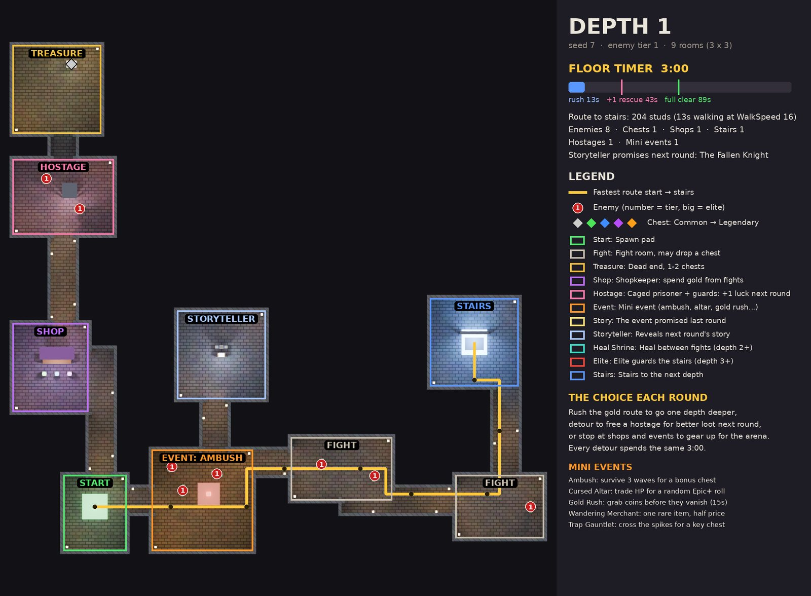
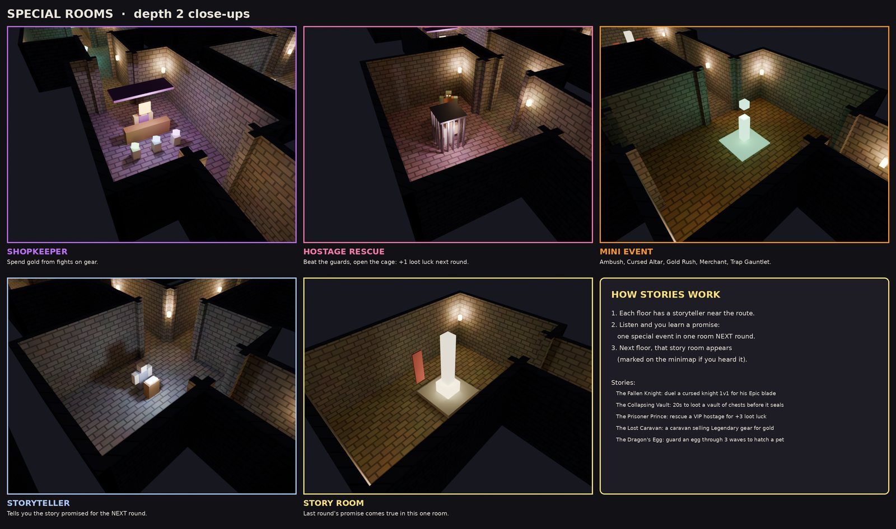
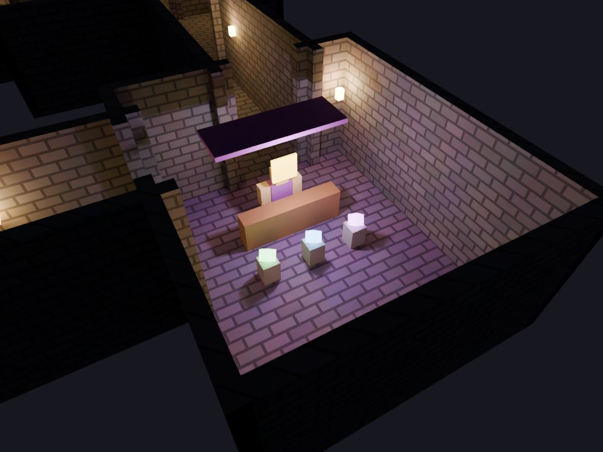
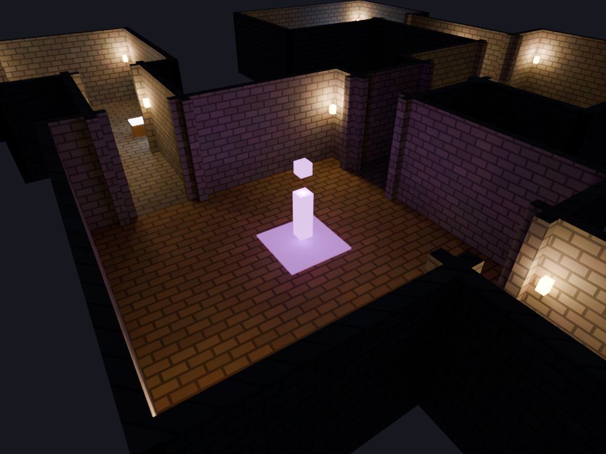
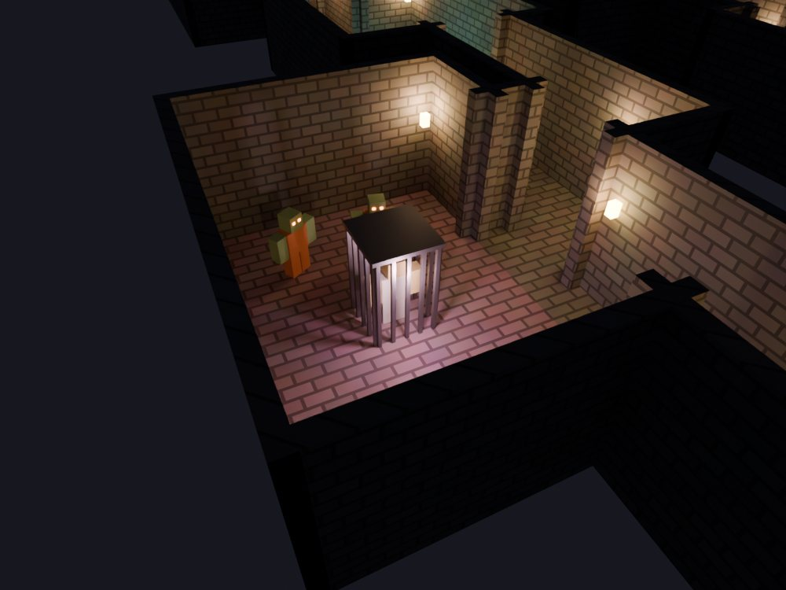
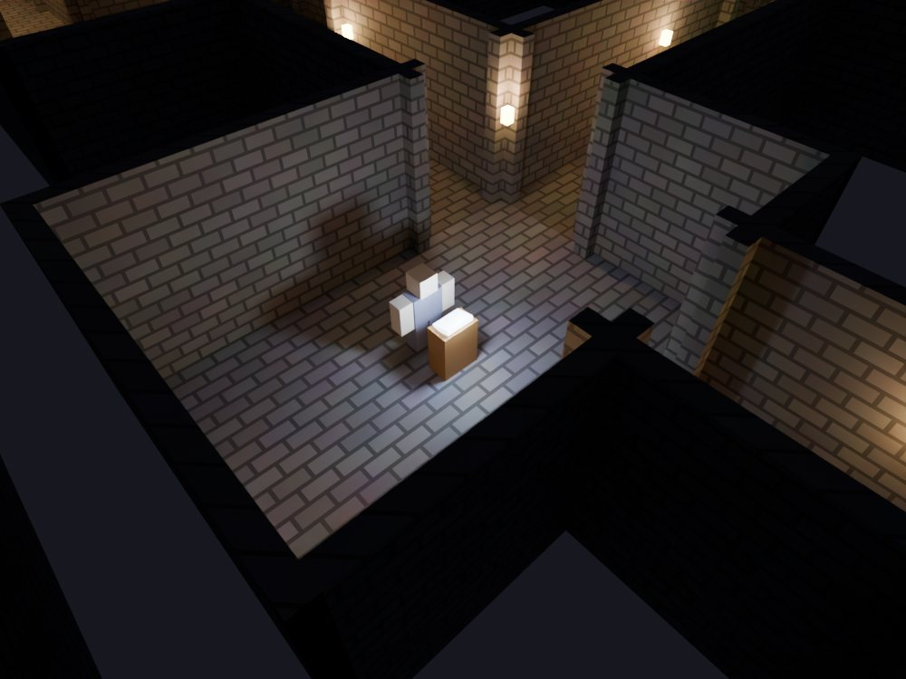
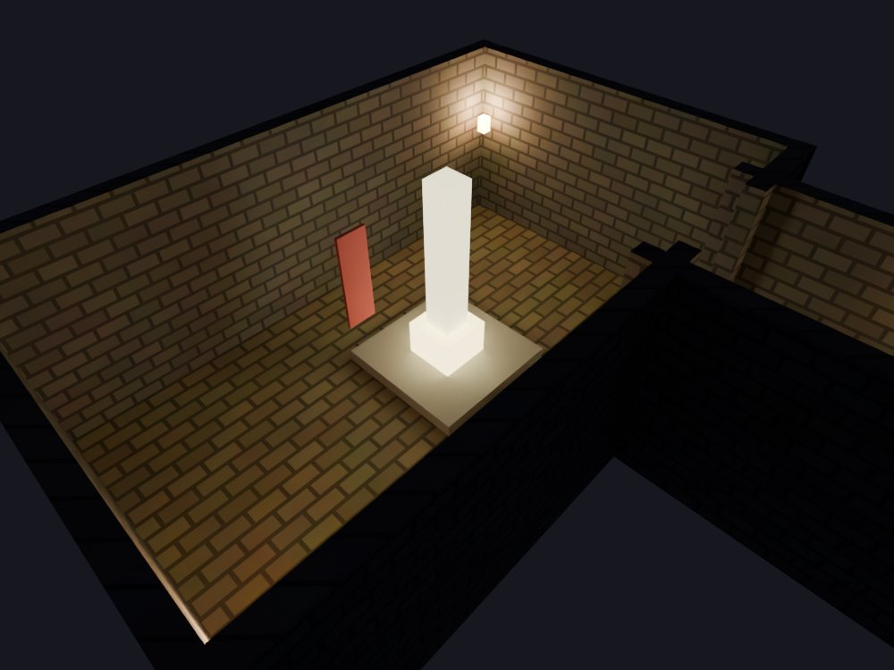
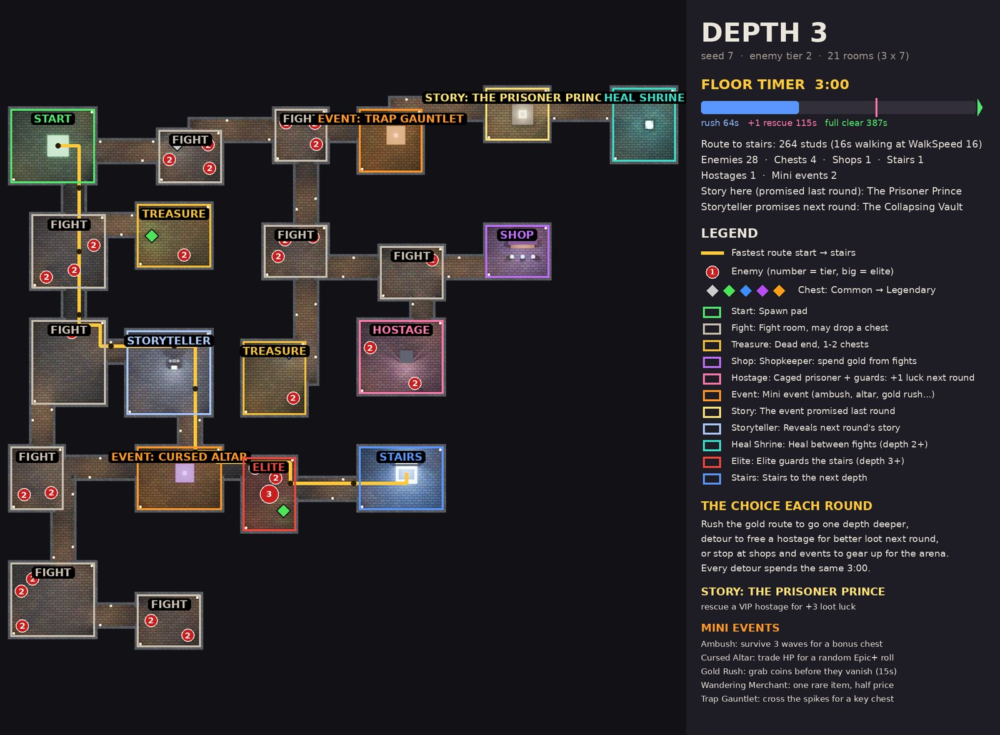
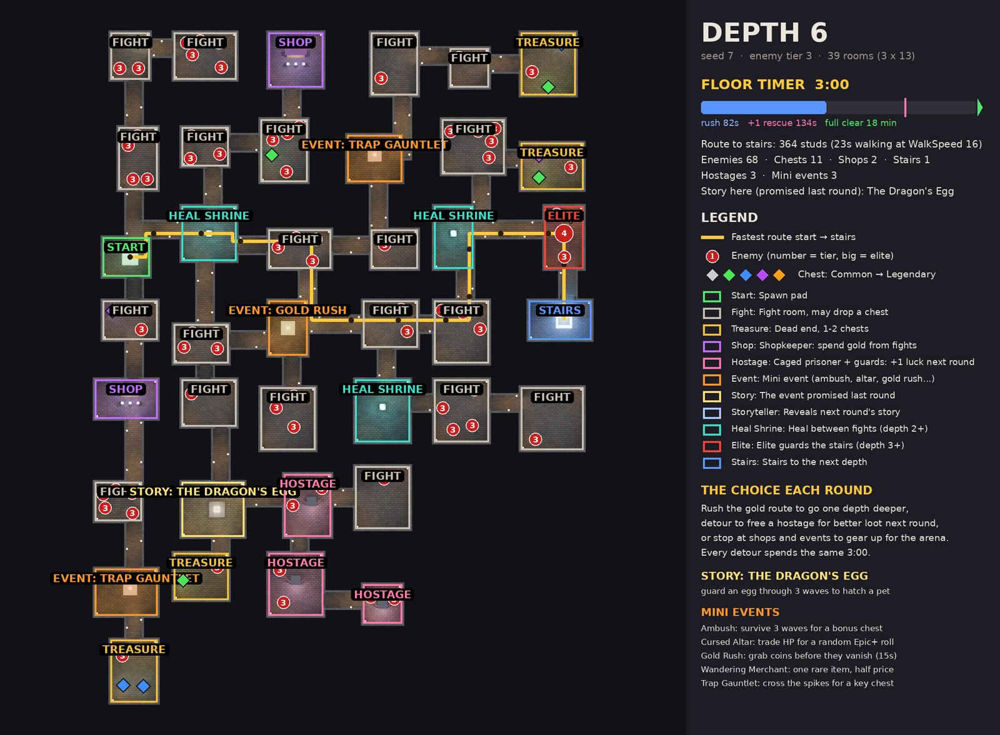
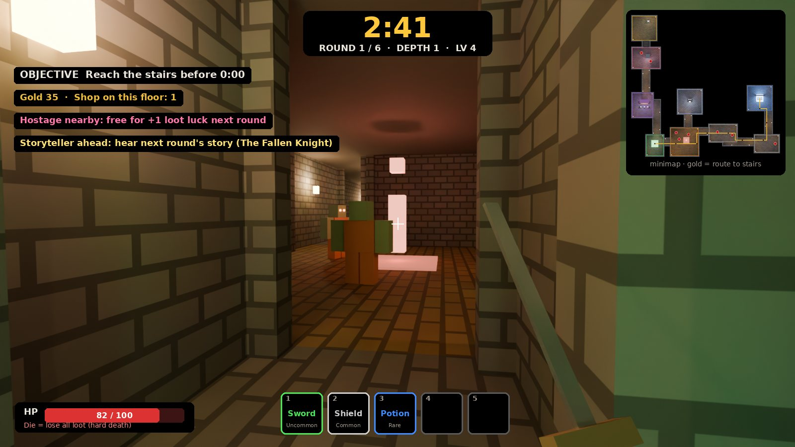

# Dungeon floors

Every floor is generated from a seed by a small, engine-free generator (`dungeon_gen.py`, Roblox stud units), so the same data can drive Roblox Parts later.

## Floor rules

| Rule | Value | Status |
|-|-|-|
| Rounds per match | 6 | Decided |
| Time per floor | 3:00 | Decided |
| Rooms per floor | 9, 15, 21, 27, 33, 39 | Decided |
| Shopkeepers, mini events, hostages | On every map | Decided |
| Going deeper | Reach the stairs in time = one depth deeper; time out = keep loot, same depth | Assumed |

!!! success "How floors grow (Cob, 2026-10-01)"
    "3x larger" means a linear base of 3, 5, 7, 9, 11, 13 rooms, multiplied by 3. It is **not** exponential growth.

## Building blocks Draft

- Tile grid of 4 studs per tile, 12-stud walls, 8-stud corridors.
- Rooms sit in a slot grid joined by a random tree; deeper floors add extra loops.
- Enemy tier rises from 1 to 3 with depth, and chest rarity odds improve.
- If a floor's nearest stairs is more than 75 s of walking away, extra stairs are added (`MULTI_EXIT`). At the current sizes it never triggers.

### Room roles

| Room | Where it appears |
|-|-|
| Start | Every floor |
| Fight | Most rooms |
| Treasure | Dead ends |
| Heal shrine | Depth 2 and deeper |
| Elite guard | The room guarding the stairs, depth 3 and deeper |
| Stairs | The room farthest from the start |
| Shopkeeper | About 1 per 15 rooms |
| Mini event | About 1 per 10 rooms |
| Hostage | About 1 per 12 rooms, caged and guarded off the fast route |
| Storyteller | Near the route on floors 1 to 5 Draft |
| Story room | One per floor, off the fast route, from floor 2 Draft |

### Shopkeepers, events and hostages Decided to exist, details Draft

{ width="32%" }
{ width="32%" }
{ width="32%" }

- **Shopkeepers** sell food, splints, potions, common and uncommon gear, backpacks, a bonesetter and pets, for Gold.
- **Mini events**: Ambush, Cursed Altar, Gold Rush, Wandering Merchant, Trap Gauntlet.
- **Hostages** are caged people or animals. Freeing one gives +1 loot luck next round, or you can ask them to join you as a [companion](companions.md) and give up that bonus.

### Stories Decided { #stories }

!!! success "Cob, 2026-10-01"
    A **story** is a promise that a certain special event will happen in one room **of the next round**. It is not a storyline and not an extra floor.

#### How stories play out Draft

{ width="49%" }
{ width="49%" }

- Floors 1 to 5 each have a **storyteller** near the route who announces the next round's story.
- On the next floor, the story plays out in **one special room off the fast route**.
- Which story comes up is picked from the match seed and round, so everyone in the match gets the same one.

| Story | What happens |
|-|-|
| The Fallen Knight | A 1v1 duel for an Epic blade |
| The Collapsing Vault | 20 s to loot a vault before it caves in |
| The Prisoner Prince | A VIP hostage worth +3 loot luck |
| The Lost Caravan | A caravan that sells Legendary gear |
| The Dragon's Egg | Defend the egg until it hatches into a pet |

## Pacing Draft

A rush straight to the stairs takes about 13 s on depth 1 and about 1:30 on depth 6, so every floor fits inside 3:00. A full clear (walk the whole tree, every fight, 2 s per chest) is what the timer squeezes.

In the trail-map test walk on a 21-room floor, a player reached the stairs at 2:15 having lit 26% of the floor.

## First person

## Open

??? question "Is the depth rule right?"
    Reaching the stairs in time moves you one depth deeper; timing out keeps you at the same depth with your loot. Assumed, not confirmed.

