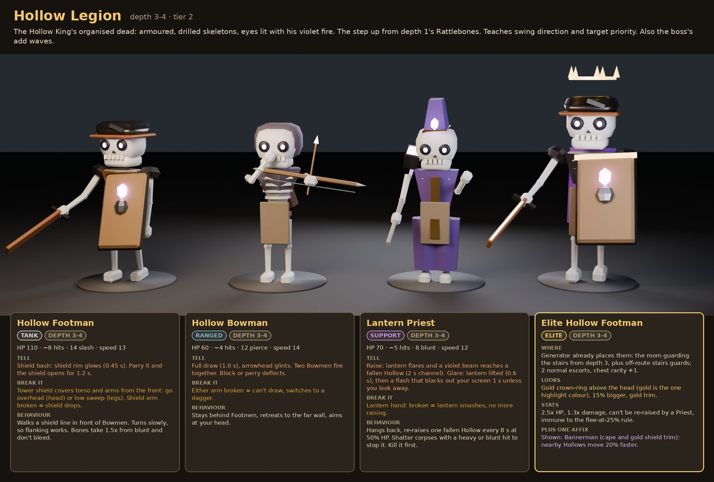
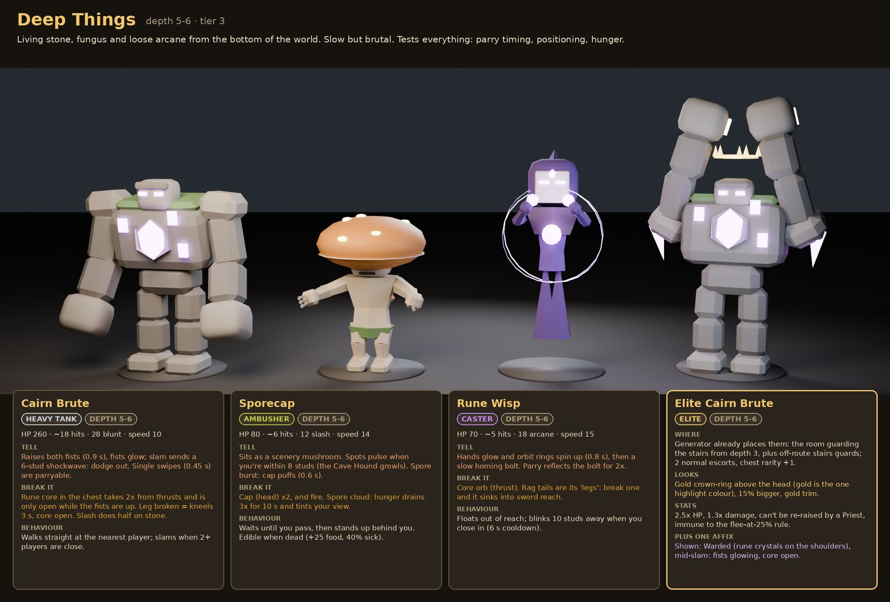
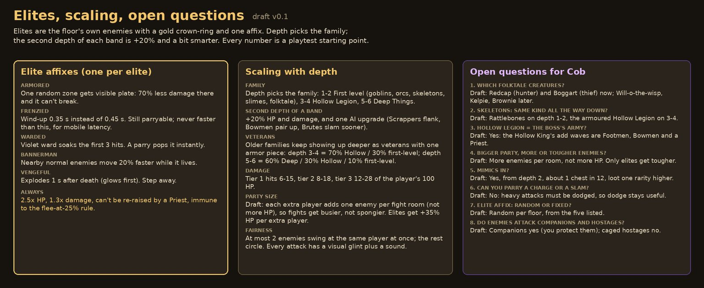

# Enemies

!!! success "Cob's ask (2026-10-01)"
    Depth 1 should have **skeletons, slimes, orcs, goblins and some folktale creatures**.

!!! warning "Being redesigned"
    The enemy roster is a Draft and the first level is being reworked to Cob's list right now. Numbers are playtest starting points. HP and damage are for the first depth of each band; the second depth adds +20%. Player HP is 100, and "hits" means torso hits with a starter sword (about 15 damage).

## Ground rules Draft

- Every humanoid enemy uses the same 15-part R15 rig as the players, so it has the same 10 hit zones and [injury rules](combat.md#enemy-injuries), with repeated hits to one limb making it worse (Cob, 2026-10-02 Decided). It can also reuse player animations. Beasts map their parts onto the same zone names.
- Every attack has a visual tell (a warm glint on the weapon) plus a sound. Standard wind-up is 0.45 s; heavier attacks are longer; nothing is ever faster than 0.35 s so parries stay fair on phones.
- Each role has its own silhouette so you can read a room at a glance: rushers small, ranged hold weapons up, tanks wide, supports in tall hats, ambushers disguised.
- At most 2 enemies swing at the same player at once; the rest circle.
- Colours: earthy bodies, violet only on magic, gold only on the elite crown.

## Families by depth

| Depth | Family | Tier | Hits a player for |
|-|-|-|-|
| 1 to 2 | First level: goblins, orcs, skeletons, slimes, folktale | 1 | 6 to 15 |
| 3 to 4 | Hollow Legion | 2 | 8 to 18 |
| 5 to 6 | Deep Things | 3 | 12 to 28 |
| Any (from 2) | Mimic | scales | 20 |

Older families keep showing up deeper as veterans with one armor piece: depth 3 to 4 is 70% Hollow and 30% first-level; depth 5 to 6 is 60% Deep, 30% Hollow, 10% first-level.

## Gated by round Decided { #by-round }

Cob counts the match in **rounds 1 to 6**; depth only rises when you take the stairs. Some enemies unlock by round, whatever depth you're at:

| From round | Enemy |
|-|-|
| 1 | Goblin Slinger (about 3 in 10 goblins) |
| 3 | Fliers; Hollow Bowman (about 1 in 3 skeletons) |
| 4 | Brood Sack |
| 5 | Elite Gulpers |

Fliers take no limb injuries.

## Spiders and mounted enemies Draft { #spiders }

Being designed now (Cob, 2026-10-02):

- **Spiders** can latch onto you; **mash Q** to break free.
- **Mounted enemies** are a new class: a rider on a mount, such as a Goblin Slinger riding a spider.

Final rules will land here once the enemy roster settles them.

## Ranged enemies In prototype { #ranged-enemies }

| Enemy | Keeps | Attack | How to answer |
|-|-|-|-|
| **Goblin Slinger** | 11 to 22 studs away | Whirls a sling and throws stones | Dodge, block, or parry the stone back |
| **Hollow Bowman** (skeleton) | 15 to 30 studs away | Draws for about 1 s with a visible glint; arrows hit individual limbs | Parry deflects, block stops the arrow |

Ranges and timings are prototype values. The tables further down are the older design notes for both.

## First level (depth 1 to 2)

Goblins, orcs, skeletons and slimes, plus two creatures from folktales. Weak alone, dangerous in mixed packs. Teaches reading tells, dodging and directional swings.

**Mix:** depth 1 is goblins, Rattlebones and slimes, with about one Orc and a small chance of a Redcap or Boggart. On depth 2, Orcs and Tusk Hogs become common, with one folktale creature per floor.

| Enemy | Role | HP | Damage | Tell | Break it | Behaviour |
|-|-|-|-|-|-|-|
| Goblin Scrapper | Rusher | 40 (~3 hits) | 8 slash | Crouches and squeals, shiv glints (0.45 s), lunges 3 studs. Parryable. | Legs: broken = no lunge. Head x2. | Packs of 2 to 3 that circle to your sides. Flees at 25% HP unless an Orc is alive; returns with a friend. |
| Goblin Slinger | Ranged | 30 (~2 hits) | 6 blunt | Whirls the sling overhead with a rising whoosh (0.8 s). Block, sidestep, or parry it back. | Throwing hand: broken = can't throw. | Holds 6 to 10 studs away and backs off toward other goblins. |
| Tusk Hog | Charger | 90 (~6 hits) | 15 blunt, knockdown | Paws the ground three times (1.0 s), tusks glint, charges straight. Too heavy to parry: dodge. | Front legs: broken = no charge. Hits a wall = stunned 2 s. | Picks the farthest player in sight. Drops monster meat (+40 food). |
| Orc Cleaver | Bruiser | 120 (~8 hits) | 18 slash, 26 chop | Roars and lifts the cleaver (0.7 s). A parry only staggers it 0.4 s, so sidestep. | Weapon arm: broken = punches. Legs: broken = can't keep up. | Walks straight in and leads goblins. |
| Rattlebones | Swarmer | 35 (~3 hits) | 7 slash | Jaw chatters, rusty sword glints (0.45 s). | Skull: break it and it stays dead. Otherwise it stands back up after 6 s unless you smash the bone pile. Blunt 1.5x. | Groups of 3 to 4 rising from bone piles. The cheap cousin of the Hollow Legion. |
| Bog Slime | Splitter | 50 (~4 hits) | 5 acid, slows | Squashes flat (0.5 s), then hops. A hit sticks: 30% slower for 2 s and eats armor durability. | Core (thrust x2). A cut that misses the core splits it into two 25 HP slimes, once. Blunt or fire kills it clean. | Slow hops, slick puddles. You can see what it swallowed: kill it for the coins or item inside. |
| Redcap | Hunter (folktale) | 90 (~6 hits) | 16 pierce | Stamps iron boots twice (loud clang, 0.5 s), then a lunging pike thrust. Parryable. | Feet are armored, go for the legs: broken = can't chase. Head x2. | At most one per floor. Hunts the bleeding player across rooms and speeds up each time it wounds someone. Drops its cap, a rare layer-3 trinket. |
| Boggart | Thief (folktale) | 45 (~3 hits) | none, steals | Giggles behind you; its hand glows violet (0.5 s). Block or parry slaps it away and stuns it 1 s. | Legs: broken = drops its sack. | Grabs one random unequipped item and runs to a dead end. Kill it to get it back before the floor ends. |

The Redcap comes from old Border folklore (a murderous goblin in iron boots); the Boggart from English folklore (a house spirit that hides and steals things).

## Hollow Legion (depth 3 to 4)

The Hollow King's dead soldiers, eyes lit with his violet fire. Disciplined formations. Teaches swing direction and target priority. Also the [boss](boss.md)'s add waves.

| Enemy | Role | HP | Damage | Tell | Break it | Behaviour |
|-|-|-|-|-|-|-|
| Hollow Footman | Tank | 110 (~8 hits) | 14 slash | Shield rim glows before a bash (0.45 s). Parry and the shield opens for 1.2 s. | Tower shield covers torso and arms from the front: go overhead or low. Shield arm broken = shield drops. | Walks a shield line in front of Bowmen. Turns slowly, so flank it. Blunt 1.5x, doesn't bleed. |
| Hollow Bowman | Ranged | 60 (~4 hits) | 12 pierce | Full draw (1.0 s), arrowhead glints. Two fire together. Block or parry deflects. | Either arm broken = switches to a dagger. | Stays behind Footmen and aims at your head. |
| Lantern Priest | Support | 70 (~5 hits) | 8 blunt | Raise: a violet beam reaches a fallen Hollow (2 s). Glare: a flash blacks out your screen 1 s unless you look away. | Lantern hand: broken = no more raising. | Re-raises one fallen Hollow every 8 s at 50% HP. Shatter corpses with blunt. Kill it first. |

## Deep Things (depth 5 to 6)

Living stone, fungus and loose arcane from the bottom of the world. Slow but brutal. Tests parry timing, positioning and hunger.

| Enemy | Role | HP | Damage | Tell | Break it | Behaviour |
|-|-|-|-|-|-|-|
| Cairn Brute | Heavy tank | 260 (~18 hits) | 28 blunt | Raises both fists (0.9 s) for a slam with a 6-stud shockwave: dodge out. Single swipes (0.45 s) are parryable. | Rune core in the chest takes 2x from thrusts, open only while the fists are up. Leg broken = kneels 3 s. Slash does half. | Walks at the nearest player; slams when 2+ are close. |
| Sporecap | Ambusher | 80 (~6 hits) | 12 slash | Looks like scenery; spots pulse within 8 studs (the Cave Hound growls). Spore burst (0.6 s). | Cap x2, and fire. Spores make hunger drain 3x for 10 s. | Stands up behind you. Edible when dead (+25 food, 40% sick). |
| Rune Wisp | Caster | 70 (~5 hits) | 18 arcane | Orbit rings spin up (0.8 s), then a slow homing bolt. Parry reflects it for 2x. | Core orb (thrust). Break a rag tail and it sinks into reach. | Floats out of reach; blinks 10 studs away when you close in. |

## Mimic (any depth from 2)

About 1 chest in 12 is a Mimic. HP 60 x tier, 20 slash. No rarity gem glow and the lid "breathes". The Owl and Cave Hound both react to it. The lid is its head (x2); broken legs mean it can't follow. It bites when you open it or stand close for 2 s, and drops loot one rarity higher than a normal chest.

## Elites

- **Where:** the room guarding the stairs from depth 3, plus off-route stairs guards, each with 2 normal escorts and chest rarity +1.
- **Look:** a gold crown-ring over the head, 15% bigger, gold trim.
- **Stats:** 2.5x HP, 1.3x damage, can't be re-raised by a Priest, never flees.
- **One random affix:**

| Affix | Effect |
|-|-|
| Armored | One random zone gets visible plate: 70% less damage there and it can't break. |
| Frenzied | Wind-up 0.35 s instead of 0.45 s. Still parryable. |
| Warded | A violet ward soaks the first 3 hits. A parry pops it instantly. |
| Bannerman | Nearby normal enemies move 20% faster while it lives. |
| Vengeful | Explodes 1 s after death (glows first). Step away. |

## Scaling

- Depth picks the family. The second depth of a band adds +20% HP and damage and one AI upgrade (Scrappers flank, Bowmen pair up, Brutes slam sooner).
- Each extra player adds one enemy per fight room rather than more HP, so fights get busier, not spongier. Elites get +35% HP per extra player.

## Open

Draft answers in brackets.

??? question "Three families by depth?"
    [First level 1 to 2, Hollow Legion 3 to 4, Deep Things 5 to 6, older families mixed in deeper.]

??? question "Is the Hollow Legion the boss's army?"
    [Yes: the Hollow King's add waves are Footmen, Bowmen and a Priest.]

??? question "Bigger party: more enemies or tougher ones?"
    [More enemies per room, not more HP. Only elites get tougher.]

??? question "Mimics in?"
    [Yes, from depth 2, about 1 chest in 12, loot one rarity higher.]

??? question "Can you parry a charge or a slam?"
    [No: heavy attacks must be dodged, so dodging stays useful.]

??? question "Elite affix random or fixed?"
    [Random per floor, from the five listed.]

??? question "Do enemies attack companions and hostages?"
    [Companions yes, so you protect them; caged hostages no.]
