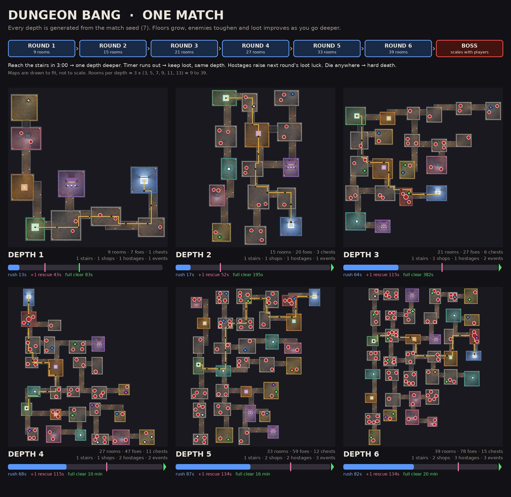
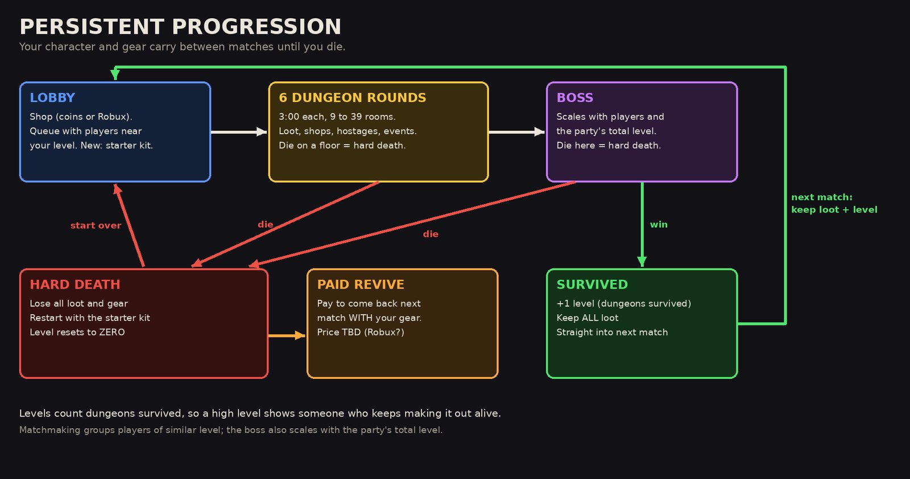

# Game loop

## A match

| Step | What happens | Status |
|-|-|-|
| Lobby | Pick a class, rearrange your pack, move gear and gold between pack and vault, shop. | Decided |
| Queue | Auto queue near your level, or launch your own party with a 5-character invite code. Parties of up to 4. | Decided |
| Floors 1 to 6 | Each floor is a 3-minute round in a freshly generated dungeon. | Decided |
| Finale | A boss scaled to player count and the party's total level. | Decided that the boss exists; formula is Draft |
| PvP | The original pitch ends with players fighting each other with the gear they gathered. | Open whether it still happens alongside the boss |
| Out | Survivors keep everything and gain a level. | Decided |

### Moving between floors Assumed

Reach the stairs before 3:00 and the next round is one depth deeper. If the timer runs out you keep your loot but stay at the same depth. The generator and pacing math assume this, but Cob has not confirmed it.

## Persistence

Decided by Cob, 2026-10-01:

- **The game is persistent.** Surviving a match carries you, your gear and your companion into the next match.
- **Level = dungeon runs survived.** Matchmaking groups players by level and the boss scales with the party's total level.
- **Hard death.** Dying anywhere means you lose all loot, restart in the basic starter gear, and your level goes back to **zero**. Your companion dies with you, pets included.
- **Gold in the vault is safe.** Gold you bring out alive is banked in the vault and survives a hard death. Gold still in your pack does not.
- **Paid revive.** You can pay with gear to be revived for the next match, and a friend can pay that gear for you.
- **Leaving early.** Leaving a match early twice in one progression costs a small gold penalty, which can be cleared with Robux.

### Inside a match

- Broken bones carry into the next round but not into the next match. Surviving a match heals everything. Decided
- At 0 HP you are only downed (and revivable) if you have a human companion that can heal. Otherwise it is a hard death. Decided
- Rescuing a hostage gives +1 loot luck on the next round. Decided

See [Lobby, queue and shop](lobby.md) for the queue rules, [Combat](combat.md) for downed and injuries, and [Companions](companions.md) for who can revive you.

## Still open

??? question "Does the boss replace the PvP finale?"
    The pitch says players fight each other at the end. Cob later asked for a boss that scales with the party. The prototype assumes the boss replaces PvP; the lobby draft keeps the question open.

??? question "Does a surviving companion level up too?"
    The companion draft assumes it carries over and gains a level. Unconfirmed.
