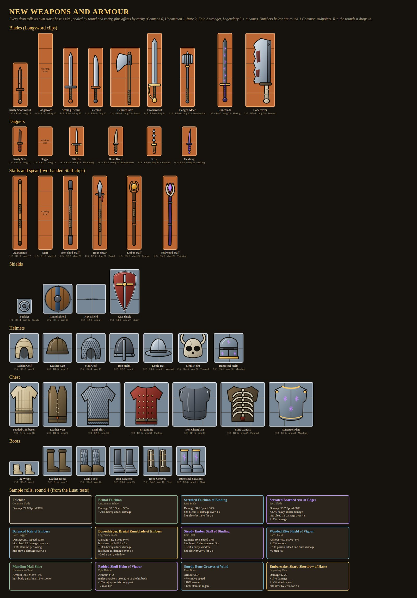
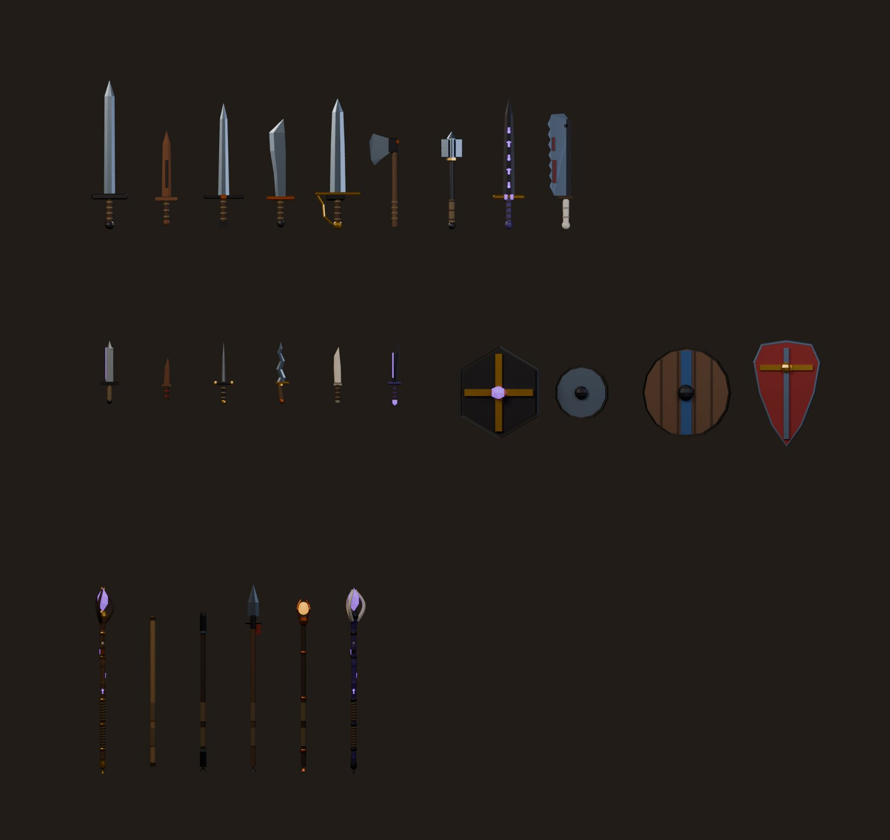

# Weapons and armour

Decided More weapons and armour, and drops that don't keep repeating the same stats.
Draft Everything else on this page (the lineup, the numbers, the odds and the bonuses) is a starting point.

## How drops roll

- **Every drop rolls its own stats.** The base stat lands within ±15% of the item's midpoint, then grows **14% per round** past round 1.
- **Rarity** multiplies it (Common ×1.0, Uncommon ×1.08, Rare ×1.17, Epic ×1.28, Legendary ×1.4) and adds **bonuses**: Common none, Uncommon 1, Rare 2, Epic 2 stronger ones, Legendary 3 plus a name ("Grimtooth, Brutal Bonereaver").
- **Names come from the bonuses:** the first gives a prefix, the second a suffix ("Serrated Falchion of Binding").
- **No back-to-back repeats:** if an item just dropped for you, the next drop rerolls it once.
- **Content is gated by round** (1–6), never by stair depth. Later rounds bring the grislier sets.
- In a test of 300 drops per round, exact repeats (same item, same numbers, same bonuses) happened 26 times in round 1, 10 in round 2 and never from round 4 on.

| Round | Common | Uncommon | Rare | Epic | Legendary |
|-|-|-|-|-|-|
| 1 | 70% | 25% | 5% | – | – |
| 2 | 55% | 32% | 11% | 2% | – |
| 3 | 40% | 35% | 19% | 5% | 1% |
| 4 | 28% | 35% | 25% | 10% | 2% |
| 5 | 18% | 32% | 30% | 16% | 4% |
| 6 | 10% | 28% | 34% | 21% | 7% |

Each point of loot luck moves 30% of every tier's chance up one tier. Events keep their rules: the Cursed Altar gives Epic or better, the Collapsing Vault one rarity better, the Lost Caravan Legendaries. Shops stock rolled items too, priced by rarity and round.

**Comparing:** the green and red arrows and the better-drop gleam work as before: melee by damage, armour against your best piece of the same kind, ranged by rarity.

## Weapons

No melee weapon is longer than 4 cells, so every class except the Witcher can wield any blade, staff or spear. The Witcher's smaller weapon slots take daggers and the short blades. All of them use the existing animations: blades swing like the Longsword, daggers like the Dagger (25% quicker), and staffs and the spear like the Staff (two-handed). Damage is the round-1 Common midpoint of a light hit; heavy hits do 1.6×.

### Blades
| Item | Size | Rounds | Damage | Built-in bonus | Look |
|-|-|-|-|-|-|
| Rusty Shortsword | 1x3 | 1–2 | 15 (speed 105%) | – | a pitted starter blade |
| Longsword | 1x4 | 1–6 | 20 (speed 100%) | – | the all-rounder |
| Arming Sword | 1x3 | 1–4 | 19 (speed 106%) | – | light and quick for a sword |
| Falchion | 1x4 | 2–5 | 22 (speed 96%) | – | broad single edge, chops hard |
| Bearded Axe | 2x3 | 2–6 | 25 (speed 88%) | Brutal | slow, heavy blows |
| Broadsword | 1x4 | 3–6 | 24 (speed 92%) | – | wide blade, knuckle guard |
| Flanged Mace | 1x3 | 3–6 | 23 (speed 92%) | Bonebreaker | breaks bones |
| Runeblade | 1x4 | 4–6 | 23 (speed 100%) | Hexing | arcane runes slow what it cuts |
| Bonereaver | 2x4 | 5–6 | 28 (speed 85%) | Serrated | grisly serrated cleaver |

### Daggers
| Item | Size | Rounds | Damage | Built-in bonus | Look |
|-|-|-|-|-|-|
| Rusty Shiv | 1x2 | 1–2 | 11 (speed 100%) | – | better than bare hands |
| Dagger | 1x2 | 1–6 | 13 (speed 100%) | – | quick stabs |
| Stiletto | 1x2 | 2–5 | 13 (speed 104%) | Disarming | slips past a guard |
| Bone Knife | 1x2 | 2–5 | 14 (speed 100%) | Bonebreaker | carved from a thigh bone |
| Kris | 1x2 | 3–6 | 14 (speed 100%) | Serrated | wavy blade, wounds bleed |
| Hexfang | 1x2 | 4–6 | 15 (speed 102%) | Hexing | arcane edge slows the target |

### Staffs and spear
| Item | Size | Rounds | Damage | Built-in bonus | Look |
|-|-|-|-|-|-|
| Quarterstaff | 1x4 | 1–3 | 17 (speed 100%) | – | plain ash pole |
| Staff | 1x4 | 1–6 | 18 (speed 100%) | – | the Arcanist's staff |
| Iron-shod Staff | 1x4 | 2–5 | 20 (speed 97%) | – | iron caps both ends |
| Boar Spear | 1x4 | 2–6 | 21 (speed 96%) | Brutal | heavy leaf head with lugs |
| Ember Staff | 1x4 | 3–6 | 21 (speed 100%) | Searing | a live coal in a copper cage |
| Voidwood Staff | 1x4 | 5–6 | 23 (speed 100%) | Thirsting | bone claws, drinks life |

The [ranged weapons](ranged.md) (Shortbow, Longbow, Crossbow, Throwing Axes) roll rarity and bonuses too, as a damage multiplier on their own damage. Bows are one cell wide so every class can carry one: the Shortbow and Crossbow are 1x3, the Longbow 1x5 (Ranger only), and Throwing Axes 2x1. **Swift** on a ranged weapon shortens the draw, the axe wind-up and the reload alike, and the hands animate faster to match.

## Shields and armour

Armour is the round-1 Common midpoint. Shields ride the left arm with a blade or dagger, and armour sits on [layer 1](inventory.md). Armour isn't shown on your character yet.

### Shields
| Item | Size | Rounds | Armour | Built-in bonus | Look |
|-|-|-|-|-|-|
| Buckler | 1x1 | 1–4 | 12 | Steady | small fist shield, easy parries |
| Round Shield | 2x2 | 1–5 | 18 | – | planks, iron rim and boss |
| Hex Shield | 2x2 | 2–6 | 21 | – | iron hexagon with a rune gem |
| Kite Shield | 2x3 | 3–6 | 27 (move -3%) | Sturdy | tall, covers the legs |

### Helmets
| Item | Size | Rounds | Armour | Built-in bonus | Look |
|-|-|-|-|-|-|
| Padded Coif | 2x2 | 1–2 | 9 | – | quilted cloth hood |
| Leather Cap | 2x2 | 1–3 | 12 | – | boiled leather skullcap |
| Mail Coif | 2x2 | 2–4 | 18 | – | riveted rings |
| Iron Helm | 2x2 | 2–5 | 21 | – | nasal helm |
| Kettle Hat | 2x2 | 3–6 | 21 | Warded | wide brim sheds blows |
| Skull Helm | 2x2 | 4–6 | 27 | Thorned | a beast skull with horns |
| Runesteel Helm | 2x2 | 5–6 | 30 | Mending | great helm, glowing runes |

### Chest
| Item | Size | Rounds | Armour | Built-in bonus | Look |
|-|-|-|-|-|-|
| Padded Gambeson | 2x3 | 1–2 | 18 | – | quilted linen coat |
| Leather Vest | 2x3 | 1–3 | 21 | – | laced hide vest |
| Mail Shirt | 3x3 | 2–5 | 30 (move -2%) | – | chain to the hips |
| Brigandine | 3x3 | 3–6 | 33 (move -1%) | Tireless | plates riveted under cloth |
| Iron Chestplate | 3x3 | 3–6 | 36 (move -4%) | – | solid iron breastplate |
| Bone Cuirass | 3x3 | 4–6 | 42 (move -3%) | Thorned | ribcage plates, grisly |
| Runesteel Plate | 3x3 | 5–6 | 48 (move -4%) | Mending | plate with glowing runes |

### Boots
| Item | Size | Rounds | Armour | Built-in bonus | Look |
|-|-|-|-|-|-|
| Rag Wraps | 2x1 | 1–2 | 6 (move +3%) | – | cloth foot wraps, light |
| Leather Boots | 2x2 | 1–4 | 9 | – | soft hide boots |
| Mail Boots | 2x2 | 2–5 | 12 (move -1%) | – | chain over leather |
| Iron Sabatons | 2x2 | 3–6 | 15 (move -2%) | – | jointed iron plates |
| Bone Greaves | 2x2 | 4–6 | 18 | Fleet | shin bones bound in hide |
| Runesteel Sabatons | 2x2 | 5–6 | 21 (move -2%) | Fleet | plate, glowing runes |

## Bonuses

Values are the Uncommon range. Each rarity above that adds 25%. Weapon bonuses work while the weapon is in an active slot; armour and shield bonuses work while the piece is in your grid.

| Bonus | Name | Effect | Uncommon range | On |
|-|-|-|-|-|
| Sharp | Sharp … of Edges | More damage | +6–12% | Melee, ranged |
| Brutal | Brutal … of Ruin | More heavy-attack damage | +10–22% | Melee |
| Swift | Swift … of Haste | Faster attacks | +5–10% | Melee, ranged |
| Light | Balanced … of Ease | Less stamina per swing | −10–20% | Melee |
| Bonebreaker | Crushing … of Breaking | More injury dealt | +15–30% | Melee |
| Serrated | Serrated … of Bleeding | Hits bleed over 4 s | 6–12 damage | Melee, ranged |
| Searing | Searing … of Embers | Hits burn over 3 s | 5–10 damage | Melee, ranged |
| Hexing | Hexed … of Binding | Hits slow the target for 2 s | 12–22% | Melee, ranged |
| Thirsting | Thirsting … of the Leech | Heal part of the damage you deal | 4–8% | Melee |
| Disarming | Twisting … of Disarming | Better disarm chance when your parry lands | +5–10 points | Melee |
| Steady | Steady … of Parrying | Wider parry window (0.40 s base) | +0.02–0.05 s | Shields, melee |
| Sturdy | Sturdy … of the Wall | More armour | +8–16% | Armour, shields |
| Padded | Padded … of Cushioning | Less injury to the part it covers | −10–20% | Helmet, chest, boots |
| Fleet | Fleet … of the Hare | Faster movement | +3–6% | Boots |
| Thorned | Thorned … of Thorns | Melee attackers take part of their hit back | 8–15% | Chest, shields, helmets |
| Tireless | Tireless … of Wind | Faster stamina regen | +8–15% | Chest, boots |
| Warded | Warded … of Warding | Less poison, bleed and burn damage | −12–25% | Helmet, chest, shields |
| Mending | Mending … of Mending | Hurt body parts heal sooner | 10–20% | Helmet, chest, boots |
| Vital | Hale … of Vigour | More max HP | +4–10 | Armour, shields |

"Built-in bonus" in the tables above is one the item always has, on top of its rarity bonuses.

Open Armour shown on the character; new ranged weapon models.
