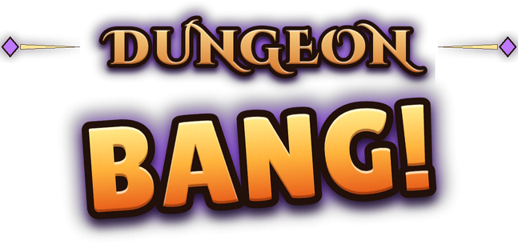

# Dungeon Bang

A first-person Roblox dungeon crawler. Parties of up to four drop into small randomized dungeons, race a 3-minute clock down through 6 depths, and carry what they find into the next match. Die and you lose it all.

## The game in one breath

1. **Queue** from the lobby, alone or with a party code. Your level is how many dungeon runs you have survived in a row.
2. **Six depths, one 3:00 clock per round.** Each depth is a fresh, seeded dungeon that grows from 9 rooms to 39, and the stairs never add time. Find the stairs, loot chests, rescue hostages, visit shopkeepers, fight.
3. **Fight with your body, not a health bar.** Swings are directional, every body part can be hurt or broken, and hunger never stops draining.
4. **Pack smart.** Your inventory is three stacked grids: armor and food, weapons, then enchants that power whatever sits beneath them.
5. **Finale.** A boss that scales with the party's size and total level. Open whether the player-vs-player fight still happens too.
6. **Persistence.** Survive and everything comes with you, plus a level. Die and it is a hard death: gear gone, level back to zero, starter clothes on.

## Systems

[**Game loop** Match flow, levels, hard death, revives](game-loop.md)
[**Dungeon floors** Generator, room counts, shops, events, hostages](dungeon.md)
[**Boss and finale** Party-scaled boss, PvP question](boss.md)
[**Lobby, queue and shop** Vault, invite codes, silverlings, goldlings and Robux](lobby.md)
[**Controls** Keys, mouse, gamepad and touch, what works today](controls.md)
[**Combat and injuries** Body zones, hunger, parries, stamina](combat.md)
[**Ranged weapons** Bows, crossbow, throwing axes, swaying reticle](ranged.md)
[**Inventory** Three layers, islands, backpacks](inventory.md)
[**Trinkets** 21 layer-3 trinkets, tiers I to IV, cursed ones](trinkets.md)
[**Shopkeepers** Eight keepers by round, rolled stock, paying and robbing](shopkeepers.md)
[**Events and cutscenes** Safe cutscenes, event rooms, stories](events.md)
[**Companions** One pet or human NPC, mini grids](companions.md)
[**Enemies** Families by depth, elites, scaling](enemies.md)
[**Map and HUD** Trail map, desktop and phone HUD](ui.md)
[**Classes and characters** Five classes, Roblox rigs, animations](characters.md)
[**Art direction** Arcane over earth, shared palette, title cards](art.md)
[**Decisions log** Everything decided, by date](decisions.md)

## How to read this wiki

Every rule carries a tag so you can tell what is settled.

| Tag | Meaning |
|-|-|
| Decided | Confirmed. Build on it. |
| Draft | Proposed by a design thread, numbers are playtest starting points. Not confirmed. |
| Assumed | A working assumption so other systems can move. Needs an answer. |
| Open | Nobody has decided yet. Listed on [Open questions](open-questions.md). |

Most of the design is still moving, so most numbers are drafts. When something is decided it lands in the [Decisions log](decisions.md) and the tag on its page changes.
