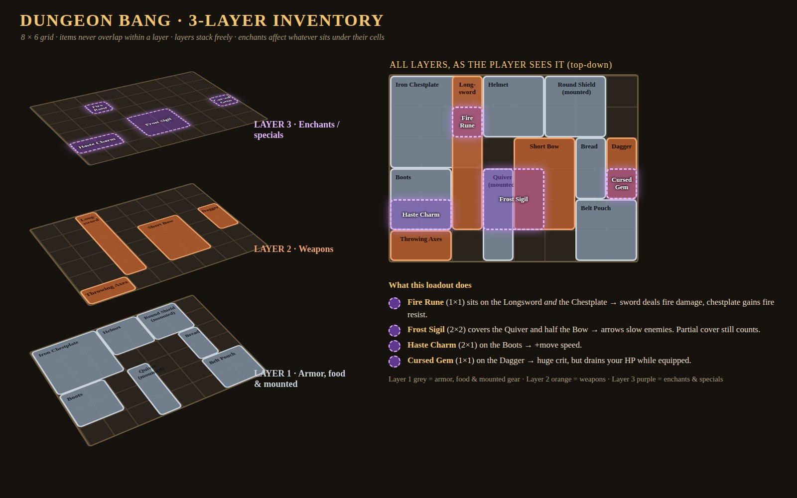
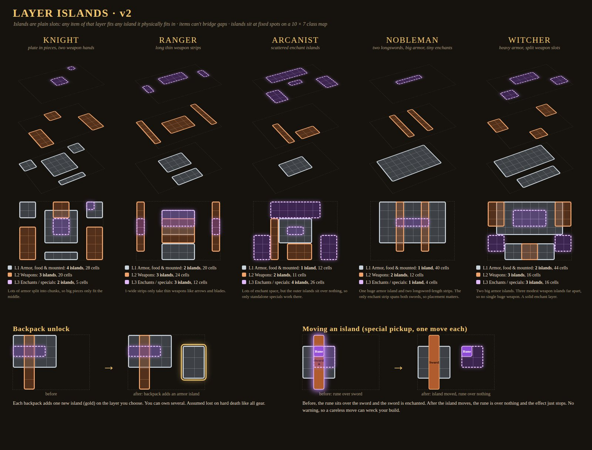
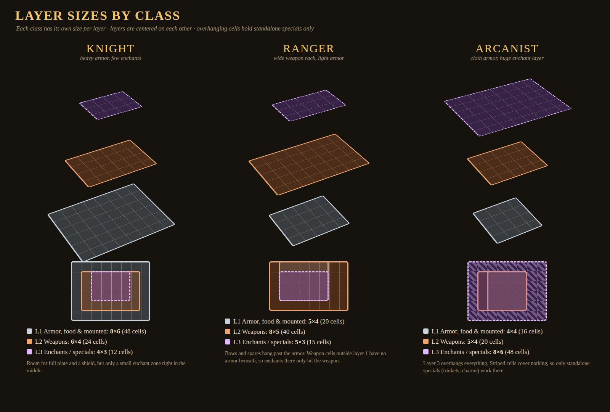

# Inventory

Your inventory is three stacked grids. Space is the main limit: big armor eats layer 1, a long weapon eats layer 2, and you place enchants where the two line up the way you want.

## The three layers Decided

| Layer | Holds |
|-|-|
| 1 | Armor, mounted gear and **food** (chest, helmet, boots, shield, quiver, lantern, pouches, rations) |
| 2 | Weapons |
| 3 | Enchants, runes, gems and specials that affect the items **beneath** them |

- Layer sizes are set by your **class**, and the layers don't have to match.
- A layer can be made of several separate **islands** (patches of grid) that never touch.
- Islands are generic slots, not body parts: any armor that fits works anywhere on the armor layer.
- **Backpacks** each add one new island, on a layer you choose. You can own several.
- A special **pickup** lets you move one island (one move per pickup). If an enchant no longer sits over what it used to boost, its effect silently stops. No warning: you can wreck your own build.
- You can rearrange your gear in the lobby before a match, during a 3-minute round, and at shopkeepers.
- Because hunger drains, food competes with armor for layer 1 space.

## Placement rules Draft

1. Every item has a fixed shape (rectangles to start) and can be rotated 90 degrees.
2. Within a layer, items never overlap. Across layers they stack freely.
3. A layer 3 item affects every layer 1 and layer 2 item under any of its cells. Partial cover counts, so one small rune on a seam can buff two items.
4. Each item type belongs to exactly one layer.
5. An item must fit entirely inside one island; it can't bridge a gap.
6. Each class's islands sit at fixed spots on a shared class map (10 x 7 in the mockup), so layers line up the same way every time.
7. Layer 3 can also hold standalone [trinkets](trinkets.md) that work by themselves, anywhere on the layer.

### Example loadout (from the mockup)

- **Fire Rune** on the Longsword and Chestplate overlap: fire damage on the sword and fire resist on the chest.
- **Frost Sigil** over the Quiver and half the Bow: slowing arrows.
- **Haste Charm** on the Boots: move speed.
- **Cursed Gem** on the Dagger: huge crits, drains HP while equipped. A risk item.

## Items on the floor Decided { #dropped-items }

From Cob, 2026-10-02:

- A dropped item shows its **real 3D mesh** in the world.
- If it has no mesh, it shows a **coloured orb** with the item's icon floating above it: **red** for weapons, **green** for food, **blue** for armor.
- Every item in the game has an inventory icon. The old prototype placeholder items that had none (Short Sword, War Axe and the old runes) have been removed.

## Active weapon Decided { #active-weapon }

From Cob, 2026-10-02: under the bag grid sits an **active weapon** slot. Drag a weapon there and it becomes the weapon in your hands.

- It takes a weapon of **any size**; there's no footprint limit.
- A weapon in the active slot **doesn't use grid space**, but it stays visible in the bag so you can drag enchants onto it.
- Dropping a weapon onto a filled active slot **swaps** them: the old weapon goes back to the grid.
- A [disarmed](combat.md#disarms) weapon returns to its active slot when you pick it up.

There are **two** active slots, **Active melee** and **Active ranged**, and **R** swaps between them (Cob, 2026-10-02).

Assumed Dropping onto a filled slot swaps the weapons; that's the prototype's choice, not yet confirmed.

### Weapon families Draft { #weapon-families }

Weapons share animations by family, so a new weapon only needs a family to swing. Built in Studio; Cob hasn't seen it in game yet.

| Family | Weapons | Notes |
|-|-|-|
| Blade | Longsword | |
| Dagger | Dagger | Swings are 25% quicker: light 0.6 s, heavy 1.1 s |
| Staff | Staff | Two-handed |
| Shield | Hex Shield | Worn in the off hand with a Blade or Dagger; put away with a Staff or a ranged weapon |
| Bow | Shortbow, Longbow | |
| Crossbow | Crossbow | |
| Throw | Throwing Axes | |

Every melee family has the same high, middle and low [stance](controls.md#stances) attacks and guards, plus parry and the disarm and pickup moves.

## Class layouts Draft { #class-layouts }

| Class | Layer 1 armor | Layer 2 weapons | Layer 3 enchants |
|-|-|-|-|
| Knight | 4 islands, 28 cells | 3 islands, 20 cells | 2 islands, 5 cells |
| Ranger | 2 islands, 20 cells | 3 islands (two 1-wide strips), 24 cells | 3 islands, 12 cells |
| Arcanist | 1 island, 12 cells | 2 islands, 11 cells | 4 islands, 26 cells |
| Nobleman | 1 island 8x5, 40 cells | Two 1x6 longsword strips, 12 cells | 1 island 4x1, 4 cells (spans both swords) |
| Witcher | 2 islands, 44 cells | 3 islands spread apart, 16 cells | 3 islands, 16 cells |

Cob's direction for the newer classes Decided: the **Nobleman** has two longswords, a larger armor area and a smaller third layer; the **Witcher** has large armor, modest separated weapon slots and a decent third layer.

## Open

??? question "Can layers grow beyond the class base?"
    Through level, a backpack item or a shop upgrade? (Backpacks adding islands is decided.)

??? question "Item shapes"
    Rectangles only, or tetris-like L and T shapes?

??? question "Does an enchant reach both layers beneath it?"
    Proposed: yes, it affects layer 1 and layer 2 under its cells. Alternative: only the layer directly beneath.

??? question "Full cover vs partial cover"
    Does covering an item completely give a stronger effect, or is it on or off?

??? question "Bound enchants on hard death"
    Lose everything in all three layers, or are some enchants bound and kept? Backpacks are assumed lost like other gear.

??? question "Is the grid what you wear?"
    Is equipped the same as being in the grid, or is there a separate equipped slot set?

