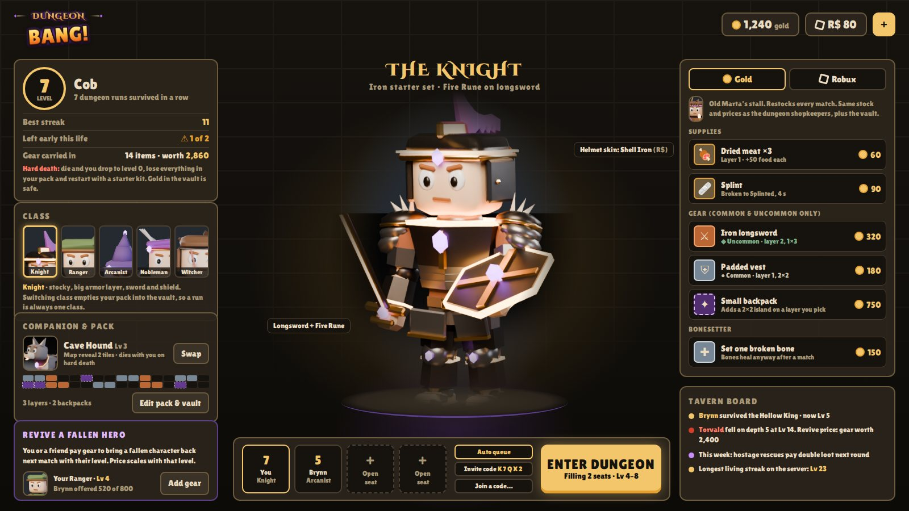
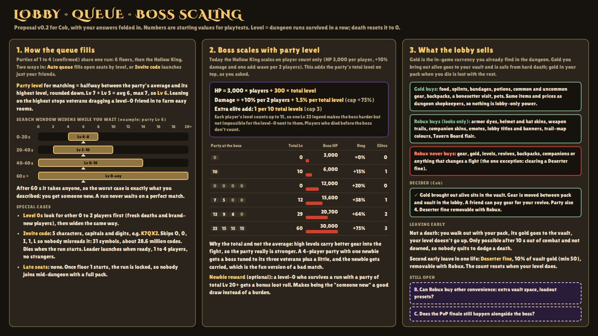
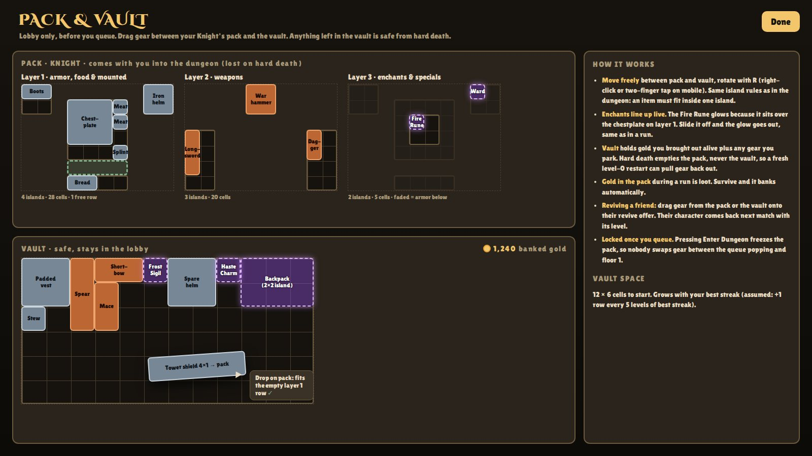

# Lobby, queue and shop

## Decided Decided

- Parties of **4**.
- The lobby shop sells with in-game currency (**silverlings and goldlings**) **or Robux**.
- Gear can be moved between your pack and the vault in the lobby before a match, and you can rearrange your inventory there.
- Coin you bring out alive sits safe in the **vault**.
- Two ways in: **auto queue**, matched around your level (worst case a new player joins), or **launch a party** with a 5-character invite code of capitals and digits.
- Leaving a match early **twice in one progression** costs a small coin penalty, removable with Robux.
- A friend can pay the gear for your revive.

## Currency Decided { #currency }

!!! success "Decided"
    The currency is **silverlings** and **goldlings**. There is no bronze. **10 silverlings make 1 goldling.**

- **Smashed props** (barrels, crates, pots, bone piles) occasionally drop silverlings. The exact drop odds are Draft.
- Robux stays separate, as before.

## Queue Draft

- Parties of 1 to 4 per run. Auto queue fills open seats by level; an invite-code party launches with just its members.
- **Invite code:** 5 characters from A to Z and 2 to 9, minus O, I and L so nobody misreads them (31 symbols, about 28.6 million codes). Valid while the party is in the lobby; expires when the run starts.
- **Party level** for matching = floor((average + highest) / 2).
- **Search window** around party level: ±2 for the first 20 s, ±4 up to 40 s, ±8 up to 60 s, then anyone.
- Level 0 to 2 players look for each other first.
- No joining once floor 1 starts. Your pack is frozen once you press Enter Dungeon.

### Leaving early Assumed

- Leaving is not a death: pack coin is banked to the vault, and your level doesn't rise.
- Only allowed after 10 s out of combat and not while downed.
- The second early leave in one life is a **Deserter fine** of 10% of vault coin (minimum 50), removable with Robux. The counter resets when your level resets.

## Pack and vault

Drag gear between your class pack (the three [inventory](inventory.md) layers) and the vault. What's in the pack goes into the dungeon and is lost on a hard death; what's in the vault is safe.

## Shop Draft

| Currency | Buys |
|-|-|
| Silverlings and goldlings | The same things dungeon shopkeepers sell: food, splints, potions, common and uncommon gear, backpacks, bonesetter, pets |
| Robux | Anything a shop sells, at a Robux price set by price bucket (amounts Draft, see [Shopkeepers](shopkeepers.md#paying)). Also cosmetics and clearing a Deserter fine |

## Open

??? question "Any other Robux conveniences?"
    For example extra vault space or loadout presets.

??? question "Does the PvP finale still happen alongside the boss?"
    See [Boss and finale](boss.md).
