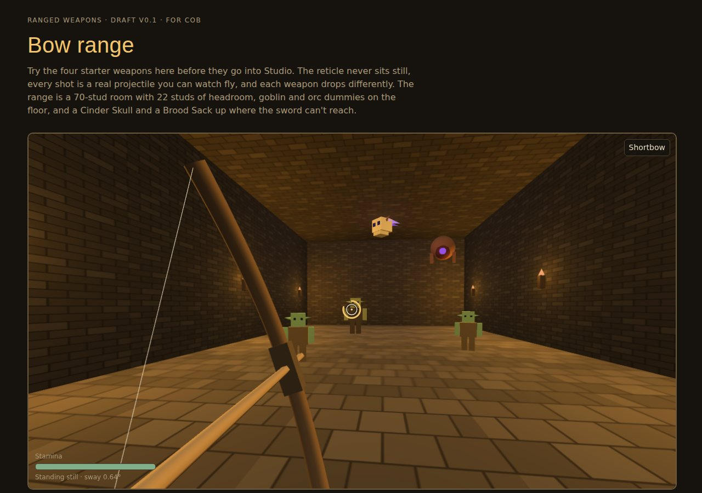

# Ranged weapons

Ranged weapons are designed and playable in a browser test range, but not yet in the Studio prototype. Everything below is Draft unless tagged otherwise.

!!! success "Cob, 2026-10-01"
    A ranged weapon system where the reticle is constantly shifting, shots are real projectiles (not instant hit rays, and not super fast), and some weapons drop more than others. **R swaps between melee and ranged.**

## Weapons Draft

| Weapon | Who | Fire | Damage | Ammo |
|-|-|-|-|-|
| Shortbow | Anyone; Rangers aim steadier | Draw 0.5 s, nock 0.55 s | 18 pierce | Quiver of 20 (layer 1) |
| Longbow | Rangers only Draft | Draw 1.0 s, nock 0.7 s, can't draw while sprinting | 34 pierce | Quiver of 20 |
| Crossbow | Anyone | Click to fire; 2.2 s reload at walking speed | 38 pierce, ignores 50% armor | Bolt case of 12 (layer 1) |
| Throwing axes | Anyone | 0.35 s wind-up, next axe 0.45 s | 26 slash | Stack of 4 (layer 2) |

**Drop.** Aimed level at 40 studs, a shortbow arrow drops about 4.7 studs, a longbow 1.7, a crossbow bolt 0.9, and a throwing axe hits the floor at about 21 studs.

**Draw.** Damage and speed grow with how far you draw. Under 15% draw there's no shot.

## The reticle

- The reticle shows where the shot **leaves**, not where it lands. Whether it ever hints at drop is Draft (the recommendation is an honest reticle with no hint).
- It always wanders a little. Walking, sprinting, jumping, low stamina and an injured bow arm make it wander more. A hurt head adds twitches.
- Holding a full draw too long makes it tremble and costs stamina.
- **Steady** (hold right mouse) holds your breath: much less sway, at a stamina cost.

## Hits

- Shots are real projectiles with their own gravity per weapon. The server checks and simulates every shot.
- Head x2 (pierce x2.5, ignores 30% armor), torso x1, limbs x0.75. Shields block from the front. Arrows can't be parried.
- Missed arrows stick where they land; walk over them to pick them up (40% break). Arrows in bodies come back through loot. Axes always come back.

## Controls

| Input | Action | Status |
|-|-|-|
| R | Swap between melee and ranged | Decided |
| Hold left click, release | Draw, then loose (crossbow: click) | Draft |
| Hold right mouse | Steady (no block with a bow) | Draft |
| Space | Dodge, which cancels a draw | Draft |
| Mobile | A weapon button above the attack pad; hold the pad to draw, release to loose; the block button becomes Steady | Draft |

## Feel

Soft sounds: a low thrum, a wooden knock, a dull thud. Custom effects only, never sparkles: a faint parchment streak in flight, and floor-tinted dust and splinters where shots land.

## Open

??? question "Reticle and longbow"
    Should the reticle stay honest, or give a drop hint? Is the longbow Ranger-only while the crossbow and axes are for everyone? Both are recommended, but only the R key has been confirmed.
