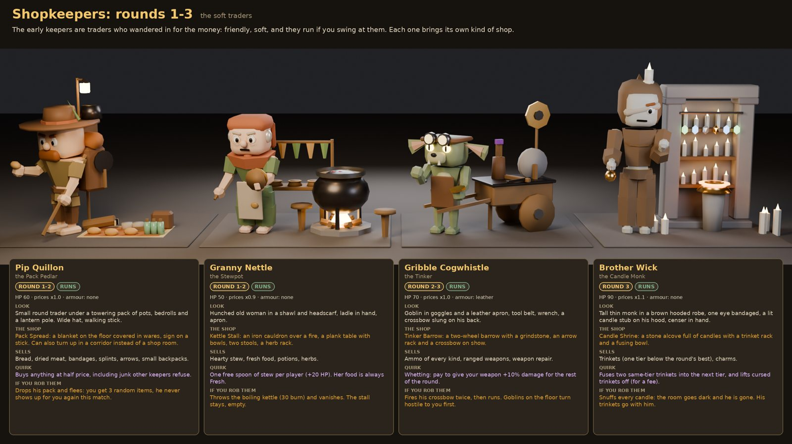
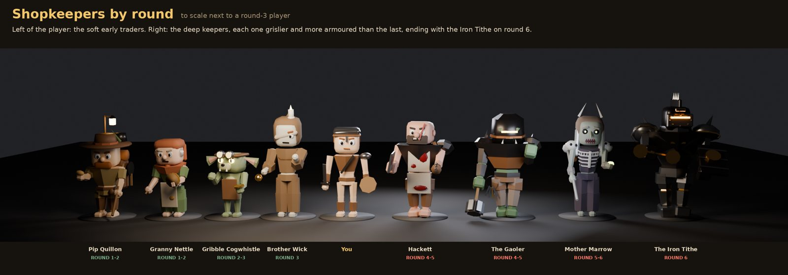
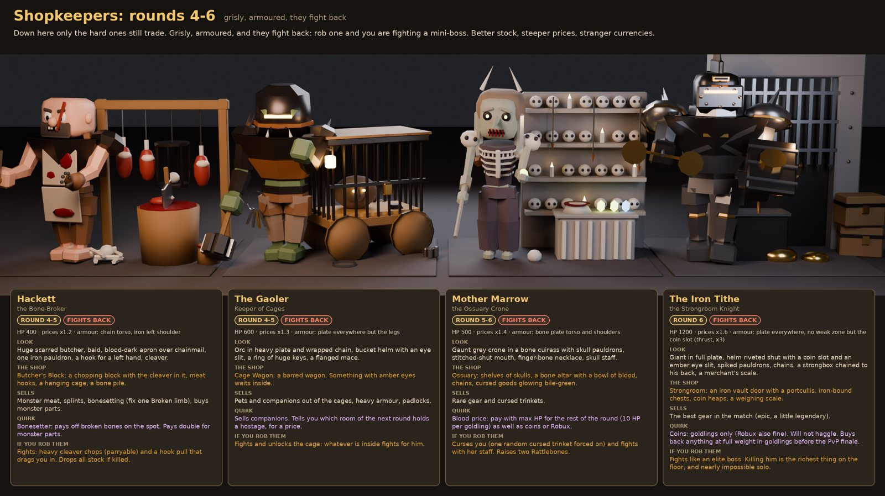
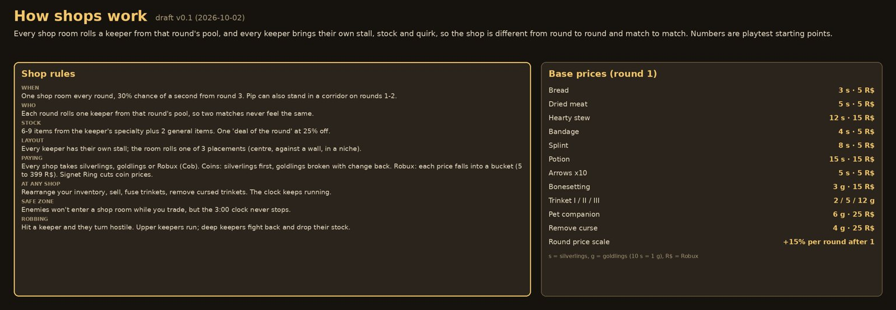

# Shopkeepers

!!! success "Cob, 2026-10-02"
    Many shopkeepers, with the later ones grislier and more armoured, and shops that vary. Cob approved this lineup ("these are good").

Decided: the eight keepers, the rounds they appear in, their stalls and what they offer. **Prices, Robux amounts and robbery numbers are Draft** starting points for playtesting.

"Deeper" here means later **rounds** (1 to 6), not stair depth.

## The keepers

| Keeper | Rounds | Stall | Sells | Special |
|-|-|-|-|-|
| **Pip Quillon**, the Pack Pedlar | 1 to 2 | Pack Spread, a blanket of wares | Food, bandages, splints, arrows, small backpacks | Buys anything at half price. Can set up in a corridor |
| **Granny Nettle**, the Stewpot | 1 to 2 | Kettle Stall, a cauldron on a fire | Stew, fresh food, potions, herbs | One free spoon of stew (+20 HP). Her food is always fresh |
| **Gribble Cogwhistle**, the Tinker (a goblin) | 2 to 3 | Tinker Barrow, with a grindstone and arrow rack | Ammo, ranged weapons, repairs | **Sharpening:** +10% weapon damage for the round |
| **Brother Wick**, the Candle Monk | 3 | Candle Shrine: an alcove, a trinket rack and a fusing bowl | [Trinkets](trinkets.md), one tier below the round's best | **Fuses trinkets** and **lifts curses** |
| **Hackett**, the Bone-Broker | 4 to 5 | Butcher's Block: meat hooks, a cage, a bone pile | Monster meat, splints, bone setting | **Sets one Broken limb.** Pays double for monster parts |
| **The Gaoler** (an orc) | 4 to 5 | Cage Wagon, with a beast inside | Pets and [companions](companions.md), heavy armour | Gives a **hostage tip** for the next round |
| **Mother Marrow**, the Ossuary Crone | 5 to 6 | Ossuary: skull shelves, a blood altar | Rare gear, cursed trinkets | **Blood price:** pay in max HP (10 max HP per goldling) |
| **The Iron Tithe**, the Strongroom Knight | 6 | Strongroom: vault door, portcullis, chests | Epic gear, a little legendary | **Goldlings or Robux only.** No haggling; buys back at full price |

## How shops vary

- **One shop room per round**, with a 30% chance of a second one from round 3.
- Each shop rolls a keeper from **that round's pool**, never the same keeper twice in a round.
- **Stock is rolled:** 6 to 9 items from the keeper's specialty plus 2 general items. One is the **deal of the round** at 25% off.
- **The stall moves:** it rolls one of 3 placements in the room (centre, against a wall, or in a niche).

## Paying

- Every shop takes **silverlings, goldlings or Robux** (Cob, 2026-10-02). The Iron Tithe takes goldlings or Robux, never silverlings. Mother Marrow also takes max HP.
- Silverlings are spent first; goldlings are broken with change (10 silverlings = 1 goldling).
- Draft **Coin price** = base price x the keeper's multiplier x (1 + 15% for each round after round 1). The [Signet Ring](trinkets.md) lowers it.
- Draft **Robux price** comes from a bucket by coin price: up to 10 silverlings = 5 R$, up to 30 = 15, up to 60 = 25, up to 120 = 49, up to 250 = 99, up to 500 = 199, more = 399.

## The shop screen In prototype { #shop-screen }

Cob, 2026-10-02:

- Holding E on a keeper eases the camera to a framed shot of the keeper and their stall.
- The shop card is a tall column on the right: the **wares** on top and **your pack** below.
- The mouse wheel, Left/Right arrows, L1/R1 or the d-pad move between wares. Scrolling past the last ware returns to the overview.
- The ware in focus gets a **gold chevron** and the green or red compare hint (see [Map and HUD](ui.md)).
- The round clock keeps running in shops.
- **You can't move** while the shop is open, and your first-person arms are hidden.

**Every keeper is animated** (Cob, 2026-10-02): idle, greet, talk, sale and refuse. The four early keepers can also startle and flee. Keepers **die like other NPCs**, with a death clip and a sinking body; they never fade out.

## At any shop

- Rearrange your inventory, sell, fuse trinkets and remove cursed trinkets.
- **The 3:00 clock keeps running** while you trade, but enemies don't come into the shop.

## Robbing a keeper Draft

Hit a keeper and they turn hostile. Keepers in rounds 1 to 3 run; keepers in rounds 4 to 6 fight and drop their stock when killed.

| Keeper | When robbed |
|-|-|
| Pip Quillon | Flees and drops 3 items; gone for the match |
| Granny Nettle | Throws the kettle (30 burn) and vanishes |
| Gribble Cogwhistle | Fires 2 crossbow shots, then runs; goblins target you |
| Brother Wick | Snuffs the candles and vanishes |
| Hackett | Fights (400 HP, chain) and drops his stock |
| The Gaoler | Fights (600 HP, plate armour except the legs) and opens the cage |
| Mother Marrow | Curses you, fights, and raises 2 Rattlebones |
| The Iron Tithe | An elite boss fight (1200 HP). Weak spot: the coin slot (thrusts x3) |

