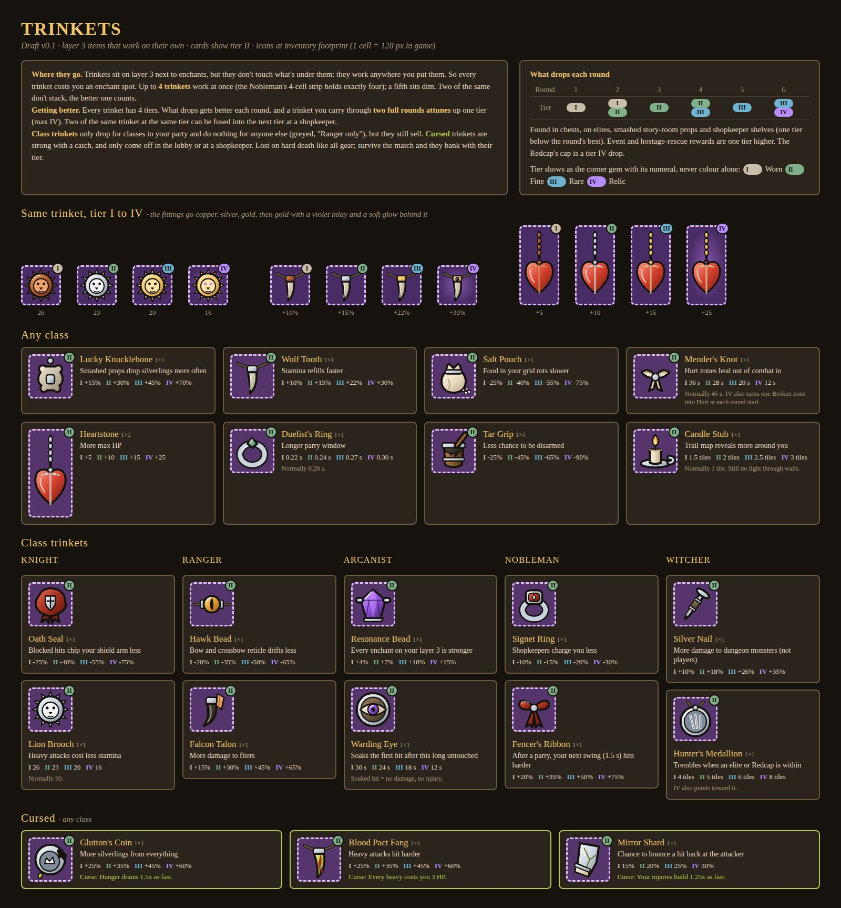

# Trinkets

!!! success "Decided"
    Trinkets you find through the rounds, getting better as the rounds go on, some of them class specific. Trinkets level up while you carry them.

Decided unless tagged otherwise. Exact numbers are starting values and may be tuned.

## How trinkets work

- **Layer 3 items**, like enchants, but standalone: a trinket works anywhere on [layer 3](inventory.md) and doesn't affect what's beneath it. Each one takes an enchant spot.
- **Up to 4 work at once.** Extras sit dim. Duplicates don't stack; the higher tier counts.
- **Four tiers:** I Worn, II Fine, III Rare, IV Relic. Each shows a corner gem with its numeral, never colour alone. Fittings go copper, silver, gold, then gold with a violet inlay and a soft violet glow (no sparkles).
- **Class trinkets** drop only for classes in the party. They do nothing for other classes (greyed out with "<Class> only") but still sell.
- **Cursed trinkets** have a strong upside and a fixed drawback, and can only be taken off in the lobby or at a shopkeeper.
- **Hard death** loses them. Surviving the match banks them at their tier.

## Getting better

| Round | Tiers that drop |
|-|-|
| 1 | I |
| 2 | I to II |
| 3 | II |
| 4 | II to III |
| 5 | III |
| 6 | III to IV |

- **Sources:** chests, elites, story-room props, shopkeepers (one tier below the round's best), event and hostage rewards (+1 tier), and Redcap's cap (IV).
- **Attunement:** a trinket carried through two full rounds (in your grid at round start, and you alive at round end) goes up one tier, to a maximum of IV.
- **Fusing:** two of the same trinket at the same tier fuse into the next tier at a shopkeeper.

## Lineup

Values are for tiers I / II / III / IV.

### Anyone

| Trinket | Size | Effect | I / II / III / IV |
|-|-|-|-|
| Lucky Knucklebone | 1x1 | Smashed props drop silverlings more often | +15 / +30 / +45 / +70% |
| Wolf Tooth | 1x1 | Stamina refills faster | +10 / +15 / +22 / +30% |
| Salt Pouch | 1x1 | Food in your grid rots slower | -25 / -40 / -55 / -75% |
| Mender's Knot | 1x1 | Hurt body parts heal sooner out of combat (normally after 45 s). IV also turns one Broken body part into Hurt at each round start | After 36 s / 28 s / 20 s / 12 s |
| Heartstone | 1x2 | Max HP | +5 / +10 / +15 / +25 |
| Duelist's Ring | 1x1 | Wider parry window (normally 0.20 s) | 0.22 / 0.24 / 0.27 / 0.30 s |
| Tar Grip | 1x1 | Less chance to be disarmed | -25 / -45 / -65 / -90% |
| Candle Stub | 1x1 | Bigger trail map reveal (normally 1 tile; still no light through walls) | 1.5 / 2 / 2.5 / 3 tiles |

### Class trinkets

| Trinket | Class | Effect | I / II / III / IV |
|-|-|-|-|
| Oath Seal | Knight | Less chip on the shield arm from blocked hits | -25 / -40 / -55 / -75% |
| Lion Brooch | Knight | Cheaper heavy attacks (normally 30 stamina) | 26 / 23 / 20 / 16 |
| Hawk Bead | Ranger | Less bow and crossbow reticle drift | -20 / -35 / -50 / -65% |
| Falcon Talon | Ranger | More damage to fliers | +15 / +30 / +45 / +65% |
| Resonance Bead | Arcanist | Every enchant on your layer 3 is stronger | +4 / +7 / +10 / +15% |
| Warding Eye | Arcanist | Soaks the first hit (no damage, no injury) after this long untouched | 30 / 24 / 18 / 12 s |
| Signet Ring | Nobleman | Lower shop prices | -10 / -15 / -20 / -30% |
| Fencer's Ribbon | Nobleman | After a parry, the next swing within 1.5 s hits harder | +20 / +35 / +50 / +75% |
| Silver Nail | Witcher | More damage to dungeon monsters (not players) | +10 / +18 / +26 / +35% |
| Hunter's Medallion | Witcher | Trembles when an elite or Redcap is near; IV points toward it | 4 / 5 / 6 / 8 tiles |

### Cursed

| Trinket | Upside | Curse | I / II / III / IV |
|-|-|-|-|
| Glutton's Coin | More silverlings from everything | Hunger 1.5x | +25 / +35 / +45 / +60% |
| Blood Pact Fang | More heavy attack damage | Each heavy costs 3 HP | +25 / +35 / +45 / +60% |
| Mirror Shard | Chance to bounce a hit back at the attacker | Injuries build 1.25x | 15 / 20 / 25 / 30% |

## Status

The trinket rules exist as a Roblox module but aren't in the Studio prototype yet Planned.
