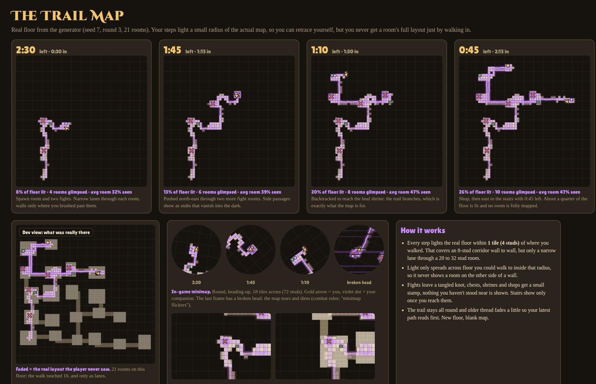
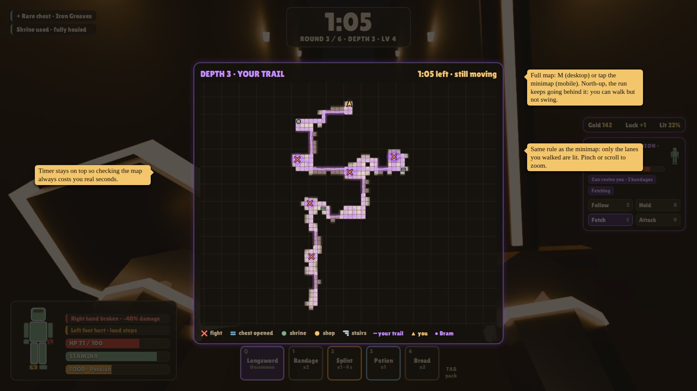
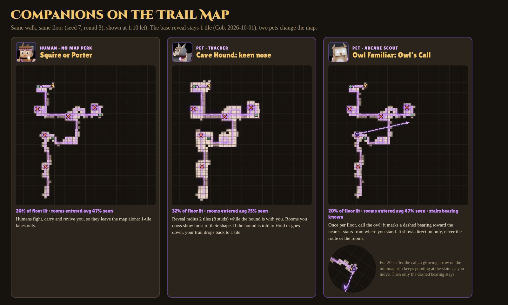
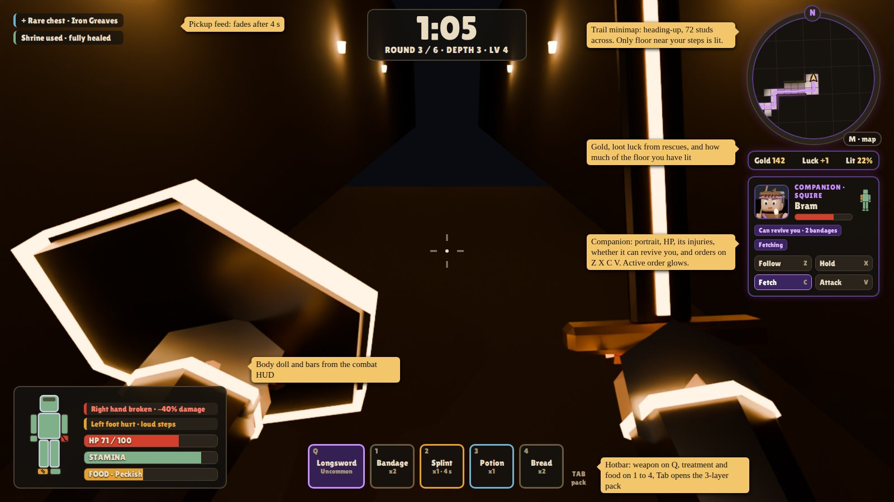
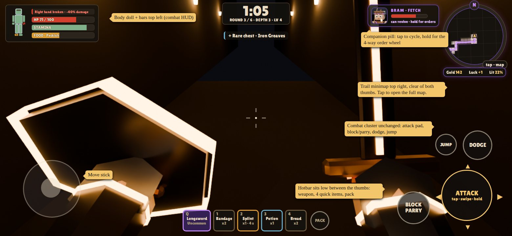

# Map and HUD

## Trail map

!!! success "Cob's brief (2026-10-01)"
    A map that tracks the player as they move, but dynamic: walking lights only a small area of the real map around your track, so you can follow your own movements without seeing a room's whole layout just because you walked in.

| Rule | Value | Status |
|-|-|-|
| Reveal radius | 1 tile (4 studs) around every point you walked | Decided |
| Light through walls | Never: light spreads only across reachable floor (flood fill) | Decided |
| Walls | Drawn only where lit floor touches them | Draft |
| Stamps | Chests (rarity colour), shrines, shops, hostages and stairs only once you've been there | Draft |
| Memory | Trail lasts the round; older thread fades a little; new floor = blank map | Draft |
| Minimap | Round, heading-up, 18 tiles (72 studs) across, N marker on the rim | Draft |
| Full map | North-up. M on desktop, tap the minimap on mobile. You can walk but not swing; timer stays visible | Draft |
| Broken head | Map tears and dims | Draft |

A 2-tile radius was tried first: rooms came out 90 to 100% revealed, which defeats the point. In the test walk on a 21-room floor, the player reached the stairs at 2:15 with 26% of the floor lit; rooms they entered averaged 47% seen.

## Companion map perks

- **Cave Hound** Decided: reveal radius 2 tiles while it is with you (test walk: 32% of floor lit, rooms entered 75% seen).
- **Owl Familiar** Decided: once per floor, a dashed bearing toward the nearest stairs. Direction only, reveals no floor. A rim arrow tracks the stairs for 20 s Assumed.
- **Humans:** no map perk.

## HUD Draft

**Desktop:** pickup feed top left, timer top centre, minimap with gold, luck and lit% plus the companion panel (portrait, HP, injuries, can-revive tag, orders on Z X C V) on the right, body doll with HP, stamina and food bottom left, hotbar bottom centre (weapon Q, items 1 to 4, Tab for the pack).

**Mobile** (landscape): body doll top left, timer top centre, minimap top right with a companion pill beside it (tap cycles orders, hold opens a 4-way wheel), hotbar low between the thumbs, and the combat cluster (attack pad, block, dodge) from [Combat](combat.md#fighting-skill).

**Timer colour:** parchment normally, amber under 30 s, red under 10 s.

## Open

??? question "Map in the finale and sharing"
    Should the map survive into the boss or PvP? Should teammates be able to share their maps?
